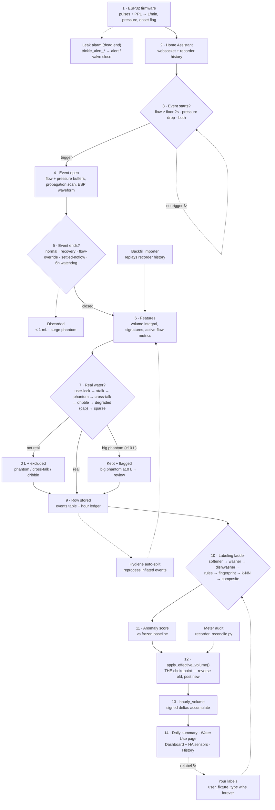

# Water-monitor pipeline

How a drop of water becomes a number on the dashboard — from ESP32 pulse counting, through event
detection, artifact screening, fixture labeling, and finally aggregation into totals.

Every step below names the responsible **file/function**, the **gates with their real thresholds**,
the **DB columns written**, and an **"if it breaks here"** symptom so you can jump from a wrong number
straight to the code that produced it.

> Thresholds verified against commit `f2afa1a` (0.3.1-dev11). If you touch the pipeline, re-check the
> constants cited here against the code before trusting them.

Two invariants hold the whole thing together:

1. **The leak alarm is firmware-side and reads live flow.** Nothing in the database — no split, zero,
   reprocess, or relabel — can mask a real leak.
2. **Every litre that reaches a total passes through `apply_effective_volume()` (step 12).** The four
   feedback loops (hygiene auto-split, meter audit, your labels, recompute) all re-enter there rather
   than writing totals directly. If totals ever disagree with the sum of events, that function — or a
   caller that bypassed it — is the first suspect.

---

## The whole pipeline at a glance

---

## Part 1 — Capture (raw water → stored event)

### 1 · ESP32 senses
**`firmware/esp-water-shut-off-3_12.yaml`**

- **Flow chain:** pulse counter (40 Hz sampling) → ÷ `ppl_main` / `ppl_irr` (runtime NVS number
  entities, *no* ÷60) → L/min → clamp `>200` (ADC garbage) and `<0.01` (noise) to `0` → 0.5 s window →
  published as `water_usage1` / `water_usage2` at ~4 Hz.
- **Pressure chain:** ADC two-point calibration → `pressure_main` / `pressure_irr` at 1.375 s window,
  2 Hz (**recorded by HA** — this is all backfill ever sees) and `pressure_*_fast` at 50 ms, 40 Hz
  (**live only, never recorded**).
- **Onset flag:** `flow_pulse_onset_*` turns ON at any pulse within a 1 s window, `delayed_off: 8s` so
  brief pauses don't split a draw.

> **If it breaks here:** wrong PPL scales every volume by a constant factor; no pulses means nothing
> downstream ever fires. Check the HA `water_usage` sensor against a bucket test and the `ppl_*`
> number entities.

#### Branch · Leak alarm (dead end by design)
`trickle_alert_main` / `trickle_alert_irr` fire when flow stays inside the min–max band for the
threshold duration → 💧 alert → optional valve auto-close. Resets on any out-of-band flow. **Fully
independent of the database** — it reads live flow, so no split/zero/reprocess/relabel below can ever
mask a leak.

### 2 · Home Assistant relays
**`app/ha_client.py · subscribe_entities`**

A persistent websocket dispatches flow, fast pressure, and onset states to one `CircuitEventDetector`
per circuit. HA's recorder *separately* stores 2 Hz pressure, onset transitions, flow, and the
cumulative meter — the raw material replayed later by the importer (step 6) and the meter audit
(step 12).

> **If it breaks here:** an add-on restart wipes the in-progress event, so draws spanning a restart
> come back short or missing and are recovered only by the backfill importer. Look for restart
> timestamps in the add-on log near the gap.

### 3 · Does an event start?
**`app/event_detector.py · CircuitEventDetector`** — first trigger to fire wins.

| Trigger | Condition |
|---|---|
| **Flow** | flow ≥ `MIN_FLOW_LPM` (per-circuit floor = 60 ÷ PPL) sustained `FLOW_START_SECONDS = 2.0`, tolerating 2 sub-floor samples mid-ramp (`FLOW_START_DIP_TOLERANCE`) |
| **Pressure** | 40 Hz fast-stream drop ≥ threshold, but only after the settled baseline has been stable ≥ `PRESSURE_STABLE_DURATION_S = 10` (blocks oscillation peaks) |
| **Pressure + flow** | pressure opens the event first; flow arrival enriches it. `start_trigger` records which fired. |

> **If it breaks here:** missed small draws mean the floor is too high for the meter; phantom starts
> mean pressure oscillation is passing the 10 s stability gate. Compare event start times against raw
> `water_usage` history.

### 4 · While the event is open
**`app/event_detector.py · RawEvent`**

Two flow records accumulate in parallel: a 1 Hz `flow_readings` list (→ the 32-point signature) and
timestamped `flow_samples` (→ the volume integral). A 400-sample pressure ring buffer (10 s @ 40 Hz)
feeds the settled-baseline tracker (a 2 s window, 3 s back). The **propagation scan** searches up to
12 s before flow onset (`_PROP_MAX_LOOKBACK_S`), using a 0.10 psi noise band and 5 consecutive
at-baseline samples to confirm the transient onset → `propagation_delay_ms`.

#### Branch · ESP full-resolution waveform
`_WF_*` constants. Firmware can stream full-resolution waveform chunks (≤1500 samples each, ≤30
records per circuit, 2 h TTL). If assembly succeeds, `signature_source = 'esp_full_*'`; otherwise the
software 1 Hz signature is the fallback.

### 5 · How does the event end?
**`app/event_detector.py`** — any one of five exits closes it.

| Exit | Condition |
|---|---|
| **Normal** | onset OFF **and** flow < `MIN_FLOW_LPM`, after a ≤120 s low-flow grace (`LOWFLOW_OFF_GRACE_S`) that coalesces fragments into one draw |
| **Pressure recovery** | dip recovered to ≤50% of its magnitude (`PRESSURE_RECOVERY_FRACTION`) for 10 s |
| **Flow override** | pressure back at baseline for 5 min (`PRESSURE_RECOVERY_FLOW_OVERRIDE_S`) → close even if flow reads stale-high (the cause of the old 27.6 h irrigation event) |
| **Settled no-flow** | flow zero the whole event + pressure settled for 60 s (`SETTLED_NOFLOW_CLOSE_S`) → close (a stuck event blocks *every* new event on the circuit) |
| **Watchdog** | hard force-close at 6 h (`MAX_EVENT_DURATION_S`) |

> **If it breaks here:** two draws merged into one points at the 120 s coalesce grace; a stretch of
> missed events points at something sitting open — grep the log for force-close / settled-no-flow
> lines.

#### Branch · Discarded (never becomes a row)
Volume < 1 mL (`MIN_EVENT_VOLUME_L`) is noise. A pressure-surge phantom — max pressure > baseline +
0.5 psi (`PRESSURE_SURGE_PHANTOM_PSI`) with no net drop — is a turbine artifact. Both are dropped.

### 6 · Features computed
**`app/feature_extractor.py · FeatureExtractor`**

- **Volume:** time integral of the timestamped samples (`flow_integral.integrate_litres`). A gap > 300 s
  marks `integration_quality = 'degraded'` (kept out of training).
- **Signatures:** 32-point flow + pressure envelopes (`flow_signature_json`, `pressure_signature_json`).
- **Hydraulics:** `pressure_delta_psi`, `pre_event_pressure_psi`, propagation delay, resistance shape.
- **Active-flow metrics** the verdicts depend on: `flow_integral_litres`, `flow_on_ratio`,
  `true_avg_flow_lpm`, `active_flow_segment_count`.
- **Time features:** `hour_sin` / `hour_cos`, day-of-week, weekend.

> **If it breaks here:** event volume disagreeing with the meter → check `integration_quality` (gap
> `'degraded'`) and `volume_recorder_litres` for the firmware-meter cross-check.

#### Branch · Backfill importer joins here
**`app/historical_importer.py`**

- **Triggers:** startup (back to `MAX_BACKFILL_DAYS`), periodic catch-up from `import_state.last_check_ts`,
  or a manual range.
- **Sources:** `flow_pulse_onset` ON/OFF transitions first (bridging gaps < 15 s of turbine chatter),
  then a sustained-flow-threshold fallback.
- **Duplicate gate:** a period overlapping an existing event by ≥30 s (or ≥10 s **and** ≥80% of the
  shorter) is skipped — safe to re-run.
- **Irrigation cross-talk post-pass:** flags main-circuit events overlapping irrigation activity when
  the pressure-swing ratio (irrigation Δ ÷ main Δ) ≥ 1.3, with the frozen ≤1.5 L cap →
  `match_rejection_reason = 'irrigation_cross_talk'`.
- Rebuilt events always carry `start_trigger = 'flow'` (no 40 Hz pressure history exists to reconstruct).

> **If it breaks here:** duplicated or still-missing backfill → check `import_state` and whether the
> gap's HA recorder history actually exists.

---

## Part 2 — The verdict cascade (is it real water?)

**`app/feature_extractor.py · _finalize_derived_verdicts()`** — checked strictly in this order; the
first match wins and sets the effective volume.

| # | Check | Condition | Result |
|---|---|---|---|
| 7a | **You already classified it** | `user_classified = 1` | your verdict stands; auto-detection never re-flags |
| 7b | **Durable irrigation cross-talk** | `match_rejection_reason = 'irrigation_cross_talk'` (from the importer) | `veff = 0`; survives every reprocess unless you relabel it real |
| 7c | **Phantom (pressure restoration)** | duration ≥120 s (`_PHANTOM_NOFLOW_MIN_DURATION_S`; a legacy event with no active-flow metrics needs the frozen 30-min floor instead) ∧ ΔP < 2.0 psi (frozen — leak safety) ∧ `flow_integral` < 1.0 L ∧ `flow_on_ratio` < 0.05. Rescue: true avg flow ≥ 2.0 L/min → real brief draw, not phantom | `is_pressure_restoration_phantom = 1`, `veff = 0`, excluded |
| 7d | **Cross-talk (other circuit's draw)** | same no-flow ceilings (`flow_integral` < 1.0 L, `flow_on_ratio` < 0.05), but a real drop: ΔP ≥ 2.0 psi ∧ duration ≥ 120 s (`_XTALK_MIN_DURATION_S`, calib-overridable). The ΔP floor separates it from 7c | `is_cross_talk = 1`, `veff = 0`, excluded |
| 7e | **Dribble (sensor trickle)** | volume < 0.5 L ∧ avg flow < 1.0 L/min ∧ ΔP < 1.5 psi (defaults, per-home calibrated). Guard: coarse meter (60 ÷ PPL floor ≥ 0.5 L/min — e.g. an oval-gear meter) measures low flow reliably → never dribble | `is_low_flow_dribble = 1`, `veff = 0`, excluded |
| 7f | **Degraded supply (pulsing water)** | `degraded_supply = 1` — flow reading unreliable | `veff = volume_litres_estimated`, **capped** (see below), method `'pulsing_supply_envelope'`, excluded |
| 7g | **Sparse envelope (brief use, long idle tail)** | duration ≥ 10 min (`_SPARSE_ENVELOPE_MIN_DURATION_S = 600 s`) ∧ flow on ≤ 10% of it | **litres kept**, `mrr = 'sparse_envelope'`, excluded from training; targeted by the hygiene loop |
| 8 | **Real use** | none of the above | `volume_litres_effective = volume_litres`, method `'raw'`, eligible for training + totals |

**Envelope cap (dev10, guards 7f).** A degraded/pulsing envelope estimate can badly over-read, so
`_cap_envelope_estimate()` limits it to `max(1.5 × flow_integral_litres, 2.0 L)`
(`_ENVELOPE_CAP_FLOW_MULT = 1.5`, `_ENVELOPE_CAP_FLOOR_L = 2.0`). The uncapped value and the cap base
are recorded in `degraded_diagnostic_json` (`envelope_cap_applied`, `envelope_uncapped_litres`) for
audit. Applies inside the degraded branch before the effective volume is written.

**Suppression-averted backstop (dev10, wraps 7c).** A leak-safety guard: when the phantom rule would
fire but the event actually **measured `volume_litres ≥ 10 L`** (`_PHANTOM_REVIEW_FLAG_LITRES = 10.0`),
the phantom verdict is *averted* — the volume is **kept, not zeroed** — and the event is surfaced for
review (`phantom_suppression_averted = 1`, `anomaly_type = 'suppression_averted'`, `flagged = 1`; still
`excluded_from_training`). Rationale: silently zeroing 10 L+ is riskier than showing a "please review"
draw. Migration `20260551` restored already-zeroed large phantoms through the ledger.

> **If it breaks here:** real water zeroed (or noise surviving to step 8) → read
> `volume_estimation_method` and the three `is_*` flags on the row to see which check fired. A big draw
> unexpectedly flagged rather than counted-clean → check `phantom_suppression_averted`. Relabeling the
> event re-runs the cascade with your label winning.

### 9 · Row stored + hour ledger posted
**`app/database.py · upsert_event_and_apply_hourly_volume()`**

One row in `events` (volumes raw + effective, signatures, artifact flags, provenance columns) is
written, and the event's litres are posted to its hour bucket via the chokepoint (step 12) in the same
step. Sequence context (`seconds_since_prev_event`, `cycle_pulse_count`) is filled in.

#### Branch · Hygiene auto-split loop
**`app/reprocess.py`**

- **Candidates:** unlabeled events whose actual flow is < 25% of their span (including inflated
  `sparse_envelope` singles).
- **Dry-run:** the importer counts real draws inside; if 2–10 are found →
- **Atomic `reprocess_window()`:** delete → auto-widen to engulf the deleted spans → re-import →
  restore the originals on any failure (all-or-nothing, no lost water).
- **Never touches** user-labeled, artifact-flagged, anomaly-flagged, or softener-session events.
- Loops back through step 6.

---

## Part 3 — Labeling (which fixture?)

**`app/database.py · reclassify_all_events_from_signatures()`** — a ladder; the first rung to claim an
event stamps `matched_fixture_type` + `matched_via` and the event exits. Cycle/session fixtures also
get a `cycle_group_id` (the History rollup key).

| Rung | Detector | Gates | Stamps |
|---|---|---|---|
| 10a | **Softener session** (`detect_softener_sessions`) | *skipped unless* `has_water_softener` + right circuit. Low-flow draws (≤1.5 L/min, peaks < 4) at regen time ±20 min (local clock); chains gaps ≤45 min, session ≤210 min; needs a backwash ≥30 L and brine span ≥90 min | `water_softener`, `matched_via='softener_session'` |
| 10b | **Washer cycle** (`detect_washer_cycles`) | anchor fill ≥9 L, 80–400 s, peak 7.5–15 L/min; siblings at 0.8–1.3× anchor peak, 2–45 min away, ≥0.5 L, ≤400 s, not flush-shaped; needs anchor + **≥2** siblings. Live path retro-stamps mates from the trailing 50 min | `washing_machine`, `matched_via='washer_cycle'` |
| 10c | **Dishwasher cycle** (`detect_dishwasher_cycles`) | ≥3 chained gentle fills: 0.2–3.5 L, peak ≤3.6 L/min, not flush-shaped; consecutive fills ≤30 min apart, whole run ≤180 min; skips artifacts + washer/softener members | `dishwasher`, `matched_via='dishwasher_cycle'` |
| 10d | **Per-event rules** (`rule_classify_event`) | first hit wins — see below | fixture type, `matched_via='rule_*'` / `'zone_default'` |
| 10e | **Fingerprint tier** (`fingerprint_matcher.py`) | only if rules abstain, *before* k-NN — see below | fixture type, `matched_via='fingerprint'` |
| 10f | **k-NN residual** | only if the fingerprint tier also abstains — see below | fixture type, `matched_via='knn'` |
| 10g | **Composite** (`composite_detector.py`) | sustained ≥300 s + usable waveform (≥30 bins, ≤15 s/bin); embedded toilet = 3–8 L excess at ≥3 L/min over a rolling 35th-percentile baseline | promotes unlabeled → `other`, `matched_via='composite'`; writes `embedded_fixtures_json` |

**10d · Per-event rules** (first hit wins):

- **Toilet:** 2.2–8.5 L, 20–150 s, peak ≥5 L/min, **and** (pressure transient or ΔP ≥1.5 psi).
- **Dishwasher (single):** 0.2–3.5 L, peak ≤3.6 L/min, `cycle_pulse_count` ≥3.
- **Shower:** ≥30 L ∧ ≥300 s ∧ peak ≥6 L/min — or 15–30 L ∧ ≥240 s.
- **Zone (zone circuits only):** ≥240 s ∧ peak ≥5 L/min.

Bands are per-home calibrated once at activation (`rule_calibration.py`: weighted-percentile fit,
capped at ≤2× the default span, do-no-harm k-fold validation — a fit that regresses recall is
discarded and the default kept). A PPL change triggers *partial* recalibration of artifact thresholds
only, never these rule bands.

**10e · Fingerprint tier** (dev11, `fingerprint_matcher.py`):

A whole-waveform nearest-neighbour match — much stronger evidence than k-NN's scalar summaries, so it
runs *ahead* of k-NN and short-circuits it on a hit.

- **Fingerprint:** the event's un-normalised waveform trio — absolute-time flow (L/min), cumulative
  volume (L), and pressure drop below baseline (psi) — sampled on a 4 s grid, 64 cells (first 256 s).
  Built only when the waveform supports it: ≥10 s, ≥4 bins, peak ≥0.3 L/min.
- **Library:** **user-labeled events only** (`user`/`training`/`cycle` sources — all carry
  `user_fixture_type`). Fingerprint labels are never added to the library, so there is no
  fingerprint→fingerprint chaining and no drift.
- **Gates:** ≥10 library labels total (`MIN_LIBRARY_N`), ≥5 per class (`MIN_CLASS_LIBRARY`). The
  accept distance is **self-calibrating** — a percentile of the library's own nearest-neighbour
  distance distribution, recomputed at load: 30th percentile once mature (≥100 labels,
  `THRESHOLD_PCTL_MATURE`), tightened to the 15th below that (`THRESHOLD_PCTL_TIGHT`).
- **CYCLE_ONLY exception:** unlike k-NN, this tier *may* inherit `washing_machine` / `dishwasher` — a
  full-waveform match against a user-confirmed example is trusted (measured 83/83 dishwashers correct).
- Measured on this home: ~30% coverage at ~97% precision; ~29% of the events the rest of the pipeline
  declined, at ~94%. Per-circuit 5-min library cache, invalidated when you save a label.

**10f · k-NN residual:**

- **Pool:** your labeled events with `excluded_from_training = 0`; needs ≥10 labels total and ≥2 per class.
- **Distance:** the active-flow scale set (preferred once events are backfilled) — log-scaled
  features weighted volume 1.52, ΔP 2.88, duration 1.40, flows 0.70/0.74, `flow_on_ratio` 0.25,
  `cycle_pulse_count` 0.75, `hour_sin`/`hour_cos` 0.35. A pre-backfill event falls back to the legacy
  scalar set.
- **Vote:** k=5, inverse-distance weighted, capped at 4 neighbors per class.
- **Abstains when:** total score < 1.5 (out-of-distribution), winner's share < 0.6 (ambiguous), or the
  winner is `other`.
- **CYCLE_ONLY guard:** a lone k-NN vote can never stamp `washing_machine` / `dishwasher` /
  `water_softener` — only their cycle detectors (or the fingerprint tier above) may. A suppressed real
  member is re-stamped by its detector on the next sweep.

> **If it breaks here:** a wrong fixture name → read `matched_via` first; it names the exact rung that
> claimed the event, so you know which thresholds to compare against the event's volume / duration / peak.

### 11 · Anomaly score + surfacing (every event)
**`app/anomaly_baseline.py`, `app/alert_manager.py`, `app/routers/history.py`**

Scored against the frozen per-home baseline (fit at activation, never online-adapted): volume, type,
and time-of-day pattern → `anomaly_score` / `anomaly_type`, setting `flagged = 1`. The core scoring is
unchanged, but dev9 wired up the surfacing that was previously dead:

- **Suppression-averted override:** a `phantom_suppression_averted` event (step 7c backstop) is forced
  anomalous *before* the artifact gate, so an excluded-from-training big draw still shows up for review.
- **`triggered_alert`** is now stamped `1` when `alert_manager.fire()` actually sends a notification —
  an audit trail of "this event alerted" (previously never populated).
- **History surfacing:** a `?filter=anomaly` view lists every `flagged` event (bypassing the "hide
  not-real" toggle); a display-time `anomaly_reason` splits the flag into user-facing badges —
  `review_draw` (suppression-averted), `estimated` (degraded/envelope), `high_usage` (rest). Marking an
  event reviewed sets `user_reviewed = 1` and clears it from the dashboard's unreviewed-anomaly count.

---

## Part 4 — Totals (events → the numbers you see)

### 12 · The volume chokepoint
**`app/database.py · apply_effective_volume()`**

The *only* path by which any event's litres reach totals:

1. If a prior posting exists (`hourly_volume_applied_litres` / `_bucket`), post a **reverse delta** to
   the old hour bucket.
2. If the new effective volume > 0, post it to the hour of `start_ts`. If it's 0, the bucket is NULL —
   the event contributes nowhere.

**Callers (the complete list):** live insert (step 9), `volume_recompute.py`, `recorder_reconcile.py`,
the low-flow coalescer, and relabel/reprocess paths. **Invariant:** `volume_ledger_discrepancy()` ≈ 0
(sum of applied amounts = sum of `hourly_volume`).

> **If it breaks here:** totals drifting from the sum of events means a writer bypassed this function —
> run the discrepancy check first.

#### Branch · Meter audit (the reconciliation loop)
**`app/recorder_reconcile.py · reconcile_circuit_volumes()`**

Hourly, over settled events (> 20 min old, ≤ 6 h horizon), **healthy events only** — never phantom,
cross-talk, dribble, degraded, or anything you classified. Computes the firmware cumulative meter's
delta across the event and stores it as `volume_recorder_litres`. **Auto-corrects** only when recorder
samples bracket the event edges within ±2 min **and** the divergence is > 0.5 L **and** > 20% of the
larger value — routing the fix through `apply_effective_volume()` like everything else. Otherwise it
just flags a backlog you can apply manually from History.

> **If it breaks here:** per-event volumes disagreeing with the physical meter → compare
> `volume_litres_effective` vs `volume_recorder_litres`, then check `reconcile_state` for whether that
> window was ever reconciled.

### 13 · Hour buckets accumulate
**`hourly_volume` table**

Signed deltas accumulate via
`INSERT … ON CONFLICT DO UPDATE SET volume_litres = volume_litres + excluded.volume_litres`. This table
is already net of every zeroing, correction, split, and relabel above, and is what the 24 h dashboard
chart reads.

#### Branch · Your labels (the feedback loop)
**`app/routers/history.py · patch_event()`**

Saving a label writes `user_fixture_type` + `user_classified = 1` — never overwritten by any machine
pass. Appliance labels propagate to cycle-mates (±45 min, tagged `fixture_label_source = 'cycle'`). 8 s
after the last edit a background reclassify re-runs the ladder over *unlabeled* events (skipped once
the baseline is locked). An hourly maturity recheck re-runs events < 6 h old so provisional labels
settle once cycle-mates exist. Any volume change re-enters at step 12.

> **If it breaks here:** a label that "won't stick" usually means you're looking at a different event
> (a split/reprocess created new IDs), or the maturity recheck re-stamped an *unlabeled* mate — your
> own labeled row is never touched.

### 14 · What you see

| Surface | File / function | How the total is computed |
|---|---|---|
| **Daily summary** | `database.py · compute_daily_summary()` | `SUM(COALESCE(volume_litres_effective, volume_litres, 0))` per circuit-day; phantoms excluded from the event *count* only (their litres are already 0) |
| **Water Use page** | `database.py · get_category_rollup()` | groups by effective type — precedence `user_fixture_type` → confirmed fixture → `matched_fixture_type` → cluster hint → `other`; `WHERE is_pressure_restoration_phantom = 0`; lifetime + windowed sums per fixture |
| **Dashboard + HA** | `routers/dashboard.py`, `fixture_publisher.py` | 24 h chart straight from the hour buckets; per-fixture and per-category totals published to Home Assistant as `total_increasing` sensors |
| **History page** | `routers/history.py` | reads `events` rows directly; the "hide not-real events" toggle (`hide_pressure_artifact_events` / `hide_cross_talk_events`) filters rows at render time **only** — totals never change, because the litres were decided back at step 7 |

---

## Quick debugging index

| Symptom | Start at | First thing to check |
|---|---|---|
| A total looks wrong | Part 4 | the event's `volume_litres_effective` vs `volume_litres`, then `volume_estimation_method` |
| Totals ≠ sum of events | step 12 | `volume_ledger_discrepancy()` — a writer bypassed the chokepoint |
| Event has the wrong fixture name | Part 3 | `matched_via` — names the exact ladder rung that claimed it |
| Event volume ≠ physical meter | step 12 branch | `volume_litres_effective` vs `volume_recorder_litres`, then `reconcile_state` |
| Event missing / merged / split | Part 1 | restart timestamps (websocket), the 120 s coalesce grace, or force-close lines (stuck event) |
| Real water shows as 0 L | step 7 | the three `is_*` flags + `volume_estimation_method` |
| Big draw flagged "review" not counted-clean | step 7c backstop | `phantom_suppression_averted` (≥10 L phantom kept + flagged on purpose) |
| Degraded volume looks capped/too low | step 7f | `degraded_diagnostic_json` (`envelope_cap_applied`, `envelope_uncapped_litres`) |
| Label came from `fingerprint` and looks wrong | step 10e | library size / self-calibrated threshold; save a correct label to re-seed |
| A label won't stick | step 13 branch | whether the ID changed (reprocess) — user rows are never overwritten |
