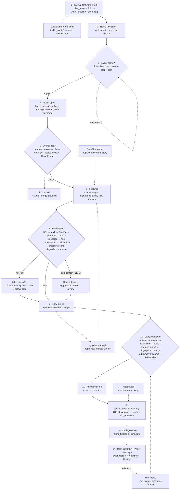

# Water-monitor pipeline

How a drop of water becomes a number on the dashboard — from ESP32 pulse counting, through event
detection, artifact screening, fixture labeling, and finally aggregation into totals.

Every step below names the responsible **file/function**, the **gates with their real thresholds**,
the **DB columns written**, and an **"if it breaks here"** symptom so you can jump from a wrong number
straight to the code that produced it.

> Verified against **0.3.1-dev49 + firmware 3.13.2**. Since the dev31 revision this
> doc last described: the training pool gained two independent exclusion filters
> (dev40 quarantine, dev46 user flag), the labeling ladder gained validated shape
> gates for dishwasher cycles and toilet flushes, the fingerprint tier began
> weighting exemplars by era, cluster re-seeds became crash-visible, and — the
> change most likely to surprise you — **every threaded database touch now goes
> through one worker thread**. dev47 then added the change most likely to
> surprise you *now*: a **learned per-home model** sits inside the ladder above
> the fingerprint and k-NN tiers, so classification is no longer a pure function
> of the code plus the frozen bands — it also depends on which model artifact is
> currently serving. If you touch this pipeline, re-check the constants
> cited here against the code before trusting them.

Three invariants hold the whole thing together:

1. **The leak alarm is firmware-side and reads live flow.** Nothing in the database — no split, zero,
   reprocess, or relabel — can mask a real leak.
2. **Every litre that reaches a total passes through `apply_effective_volume()` (step 12).** The four
   feedback loops (hygiene auto-split, meter audit, your labels, recompute) all re-enter there rather
   than writing totals directly. If totals ever disagree with the sum of events, that function — or a
   caller that bypassed it — is the first suspect.
3. **One SQLite connection, one thread** (dev46 46a). The add-on shares a single
   connection (`check_same_thread=False`), so every threaded DB touch goes through
   `database.run_db`, whose executor has exactly one worker. Two threads on that
   connection corrupt each other's statement mid-flight — that is what produced
   `sqlite3.InterfaceError: bad parameter or other API misuse` twice in 2026-08.
   `tools/audit_db_thread_safety.py` enforces it and must run to zero; it resolves
   every path reaching the connection, including sync helpers that merely close
   over it. Long passes are submitted **chunk-wise** (chunk = transaction = one
   `run_db` call) so a queued page render interleaves instead of waiting minutes.

---

## The whole pipeline at a glance

---

## Part 1 — Capture (raw water → stored event)

### 1 · ESP32 senses
**`firmware/esp-water-shut-off-3_13.yaml`** (firmware 3.13 rewrote flow measurement)

- **Flow chain:** ESPHome **`pulse_meter`** — times the interval *between pulse edges* (100 µs bounce
  filter), so the rate is already period-smoothed; no fixed sampling window. Rate (pulses/min) ÷
  `ppl_main` / `ppl_irr` (runtime NVS number entities) → L/min, **no ÷60** (`pulse_meter` already
  reports per-minute). Clamp `>200` and `<0.01` L/min to `0`; published as `water_usage1` /
  `water_usage2` throttled to 4 Hz (`throttle: 250ms`).
- **Volume from pulse totals, not rate integration:** litres accumulate from the `pulse_meter` total's
  count deltas (`water_total_l_*`), *not* by integrating the rate — integrating would overcount every
  tail by `last_rate × timeout`.
- **`timeout: 10s` + fast-zero tail:** `pulse_meter` holds its last rate until the 10 s timeout, so a
  250 ms interval publishes `0` early (once ~2.5× the expected pulse interval passes, floored at 600 ms)
  to kill the flat "square tail" a closed tap would otherwise leave.
- **Pressure chain:** ADC two-point calibration → `pressure_main` / `pressure_irr` at 1.375 s window,
  2 Hz (**recorded by HA** — this is all backfill ever sees) and `pressure_*_fast` at 50 ms, 40 Hz
  (**live only, never recorded**).
- **Onset flag:** `flow_pulse_onset_*` turns ON at any pulse within a 1 s window, `delayed_off: 8s` so
  brief pauses don't split a draw (now keyed off last-pulse age, same behaviour).

> **If it breaks here:** wrong PPL scales every volume by a constant factor; no pulses means nothing
> downstream ever fires. Check the HA `water_usage` sensor against a bucket test and the `ppl_*`
> number entities. A flat non-zero "tail" after a tap closes → the fast-zero interval isn't firing.

#### Branch · Leak alarm (dead end by design)
`trickle_alert_main` / `trickle_alert_irr` fire when flow stays inside the min–max band for the
threshold duration → 💧 alert → optional valve auto-close. Resets on any out-of-band flow. **Fully
independent of the database** — it reads live flow, so no split/zero/reprocess/relabel below can ever
mask a leak.

### 2 · Home Assistant relays
**`app/ha_client.py · subscribe_entities`**

A persistent websocket dispatches flow, fast pressure, and onset states to one `CircuitEventDetector`
per circuit. HA's recorder *separately* stores 2 Hz pressure, onset transitions, flow, and the
cumulative meter — the raw material replayed later by the importer (step 6) and the meter audit
(step 12).

> **If it breaks here:** an add-on restart wipes the in-progress event, so draws spanning a restart
> come back short or missing and are recovered only by the backfill importer. Look for restart
> timestamps in the add-on log near the gap.

### 3 · Does an event start?
**`app/event_detector.py · CircuitEventDetector`** — first trigger to fire wins.

| Trigger | Condition |
|---|---|
| **Flow** | flow ≥ `MIN_FLOW_LPM` (per-circuit floor = 60 ÷ PPL) sustained `FLOW_START_SECONDS = 2.0`, tolerating 2 sub-floor samples mid-ramp (`FLOW_START_DIP_TOLERANCE`) |
| **Pressure** | 40 Hz fast-stream drop ≥ threshold, but only after the settled baseline has been stable ≥ `PRESSURE_STABLE_DURATION_S = 10` (blocks oscillation peaks) |
| **Pressure + flow** | pressure opens the event first; flow arrival enriches it. `start_trigger` records which fired. |

**Stale-timer guard (dev29).** If the flow-sustain timer is armed but > `FLOW_START_STALE_GAP_S = 30`
passes with no flow sample, the timer is discarded and the next sample starts fresh. Without it a timer
armed by a brief slug could stay armed for minutes (the `pulse_meter` rate simply stops ticking rather
than sending zeros), so the next burst instantly satisfied the 2 s sustain and **backdated `start_ts`
across the whole quiet gap** — the bug that merged booster-pump top-up slugs ~5 min apart into one
inflated event.

> **If it breaks here:** missed small draws mean the floor is too high for the meter; phantom starts
> mean pressure oscillation is passing the 10 s stability gate; separate draws merged into one long
> backdated event → the stale-timer guard. Compare event start times against raw `water_usage` history.

### 4 · While the event is open
**`app/event_detector.py · RawEvent`**

Two flow records accumulate in parallel: a 1 Hz `flow_readings` list (→ the 256-point signature) and
timestamped `flow_samples` (→ the volume integral). A 400-sample pressure ring buffer (10 s @ 40 Hz)
feeds the settled-baseline tracker (a 2 s window, 3 s back). The **propagation scan** searches up to
12 s before flow onset (`_PROP_MAX_LOOKBACK_S`), using a 0.10 psi noise band and 5 consecutive
at-baseline samples to confirm the transient onset → `propagation_delay_ms`.

#### Branch · ESP full-resolution waveform
`_WF_*` constants. Firmware can stream full-resolution waveform chunks (≤1500 samples each, ≤30
records per circuit, 2 h TTL). If assembly succeeds, `signature_source = 'esp_full_*'`; otherwise the
software 1 Hz signature is the fallback.

**How a capture gets attached — one capture, one event (dev37).** In order:

1. **Candidate scan** (`_find_waveform`): scores every buffered record for the circuit on
   duration-overlap alone; recency window `_WF_MATCH_WINDOW_S = 90 s`, gate
   `_WF_MATCH_MIN_SCORE = 0.55`.
2. **Claim ledger** (`_wf_already_claimed`): already-claimed records are skipped **inside** the loop so
   the runner-up can still win, rather than the match being rejected afterwards. **The events table is
   the ledger** — no side table, so claims survive restarts. With a `boot_id` it probes exactly; without
   one it falls back to a same-circuit 48-hour probe on `waveform_event_id`.
3. **Physical-consistency sanity gate:** if the capture's `peak_flow < 0.95 × true_avg_flow_lpm`
   (`_WF_PEAK_SANITY_RATIO`) the record is rejected **whole** — ΔP, propagation delay, signatures and
   display envelope all came from the same wrong capture, so none of it is trusted (`[wf-sanity-reject]`).
4. **Consume on success:** `pop_waveform_record()` removes it from the buffer. Before dev37 this had
   *zero callers* — the buffer was a plain FIFO, which is how one capture could enrich several events.

**Repair sweeps** (`wf_repair_backfill.py`, one-shot at startup) fix the historical damage in two
passes, because one predicate could not see both failures: `repair_misattached_waveforms` catches
`true_avg > peak` violations, while `repair_shared_captures` groups byte-identical `flow_max_json`
(a shared capture overwrites *both* peaks with the same plausible value, so it is invisible to the
first predicate), keeps the member whose duration best matches the 200 Hz sample count, and de-enriches
the losers — NULLing signatures rather than relabelling them `'software'`.

New columns: `events.waveform_boot_id` plus `*_pre_repair` audit fields and `wf_repair_verdict`
(migration `20260573`; its index is **deliberately non-unique** — a constraint violation inside the
wide live upsert would abort event storage), and `flow_sig_span_s` / `pressure_sig_span_s`
(`20260809`, the honest per-channel captured span used by the event modal's time axis).

> **Claim-ledger key caveat (dev41):** `waveform_boot_id` is **not** NVS-backed monotonic — the
> firmware has no persisted boot counter, so `(boot_id, event_id)` can in principle collide across
> reboots. The same-circuit **48-hour probe** in `_wf_already_claimed` is therefore load-bearing,
> not a stopgap for legacy NULLs. New ESP-sourced rows are asserted non-NULL at the insert path
> (warning-level; 1,842 legacy NULLs stay as honest unknowns).

### 5 · How does the event end?
**`app/event_detector.py`** — any one of six exits closes it.

| Exit | Condition |
|---|---|
| **Normal** | onset OFF **and** flow < `MIN_FLOW_LPM`, after a ≤120 s low-flow grace (`LOWFLOW_OFF_GRACE_S`) that coalesces fragments into one draw |
| **Pressure recovery** | dip recovered to ≤50% of its magnitude (`PRESSURE_RECOVERY_FRACTION`) for 10 s |
| **Flow override** | pressure back at baseline for 5 min (`PRESSURE_RECOVERY_FLOW_OVERRIDE_S`) → close even if flow reads stale-high (the cause of the old 27.6 h irrigation event) |
| **Settled no-flow** | flow zero the whole event + pressure settled for 60 s (`SETTLED_NOFLOW_CLOSE_S`) → close (a stuck event blocks *every* new event on the circuit) |
| **Watchdog** | hard force-close at 6 h (`MAX_EVENT_DURATION_S`) |
| **Sawtooth hold-close** (dev37, *pump mode only*) | the trailing `SAWTOOTH_HOLD_CLOSE_S = 420 s` contain nothing but micro-pulses over idle (each shorter than `SAWTOOTH_PULSE_MAX_S = 25 s`, idle = `SAWTOOTH_IDLE_FRACTION 0.18 × MIN_FLOW_LPM`) → **finalize at the last real activity, not at `now`**, trimming the recharge tail out of the event's duration |

> **If it breaks here:** two draws merged into one points at the 120 s coalesce grace; a stretch of
> missed events points at something sitting open — grep the log for force-close / settled-no-flow
> lines. On a pump home, a draw whose duration includes a long recharge tail points at the sawtooth
> hold-close not firing.

#### Branch · Discarded (never becomes a row)
Volume < 1 mL (`MIN_EVENT_VOLUME_L`) is noise. A pressure-surge phantom — max pressure > baseline +
0.5 psi (`PRESSURE_SURGE_PHANTOM_PSI`) with no net drop — is a turbine artifact. Both are dropped.
**Winterizing a circuit** (Part 6) is a third path: `set_winterized(True)` discards the in-flight event
outright and both the flow and fast-pressure handlers return early while it is set, so no event can
start — nothing is zeroed because nothing is ever stored.

### 6 · Features computed
**`app/feature_extractor.py · FeatureExtractor`**

- **Volume:** time integral of the timestamped samples (`flow_integral.integrate_litres`). A gap > 300 s
  marks `integration_quality = 'degraded'` (kept out of training).
- **Averages — two different figures (dev38 doc):** `avg_flow_lpm` is a plain **sample mean of the
  detector's reading list, idle zeros included** — it dilutes toward 0 on any event with a no-flow
  tail and is *not* a physical average. `true_avg_flow_lpm` (volume ÷ active time, from the
  timestamped samples) is the figure the verdicts, the UI and any analysis should use.
  `daily_summary.avg_flow_lpm` is an unweighted **mean of those per-event sample means** — not a
  volume- or duration-weighted daily average. A dev38 write-time clamp also guarantees
  `true_avg_flow_lpm ≤ peak_flow_lpm` (the two came from differently-sampled series, and 825
  historical rows violated it; backfilled by migration 20260802).
- **Meter registration estimate (dev38, annotation only):** `registration_est_litres` — the volume
  after correcting the oval-gear meter's measured low-flow under-registration
  (`flow_integral._REGISTRATION_RATIO`: reads ~27% low at 1.5–2.5 L/min, ~10% at 2.5–4, ~6% at
  4–8; unity ≥ 8). The curve comes from the 2026-08 audit's pressure-witness inversion and is
  **relative to the meter's own ≥ 8 L/min band** — a common-mode scale error is invisible to it —
  and remains pending utility-anchor validation. Sub-1 L/min flow gets **no** correction
  (non-registration cannot be recovered by a ratio; those draws stay governed by 7j below).
  Stored only when the correction is material (> 2%); **never feeds `volume_litres`,
  `volume_litres_effective`, or any total.**
- **Signatures:** 256-point *proportional* flow + pressure envelopes (`SIGNATURE_POINTS = 256`, widened
  32→64→256; point *i* = *i*/256 through the event) — plus a separate 32-cell × 1 s *absolute-time*
  onset/offset **edge signature** (`onset_signature_json` / `offset_signature_json`) that feeds the
  edge-signature k-NN tier.
- **Hydraulics:** `pressure_delta_psi`, `pre_event_pressure_psi`, propagation delay, resistance shape.
  `hydraulic_resistance` is **ΔP ÷ `avg_flow_lpm`** (not true_avg), gated on avg ≥ 0.15 ∧
  transient captured ∧ ΔP > 0 — and since dev38 it is recomputed wherever ΔP changes (ESP
  enrichment, late upgrade, re-finalize), because the 2026-08 audit found 1,324 rows carrying the
  pre-enrichment ratio (backfilled by migration 20260803).
- **Active-flow metrics** the verdicts depend on: `flow_integral_litres`, `flow_on_ratio`,
  `true_avg_flow_lpm`, `active_flow_segment_count`.
- **Time features:** `hour_sin` / `hour_cos`, day-of-week, weekend — computed in the **home
  timezone** since dev38 (they were UTC-based: the audit found `hour_of_day` matched the UTC hour
  on 100% of events and `day_of_week` was wrong on 30%). `events.time_features_tz` records the
  zone that produced each row's features; a deferred boot task rewrites rows whose marker
  mismatches once tz detection lands (migrations run before HA answers).
- **Waveform display metadata (dev38):** `event_waveforms.flow_src_n / press_src_n /
  flow_src_hz / press_src_hz` — per-channel source sample counts and (ESP only) the 200 Hz fixed
  rate, so the History modal can draw each channel on its own honest seconds axis. The two
  channels are binned from different streams; before dev38 they shared one index axis and were
  visibly misaligned on 18% of events. ESP channels use the capture span (`n/hz`, basis
  `uniform_exact_unanchored` — the capture's wall-clock start is not recoverable); software
  channels are duration-stretched (`uniform_approx` — the event-driven series has no recoverable
  axis).

> **If it breaks here:** event volume disagreeing with the meter → check `integration_quality` (gap
> `'degraded'`) and `volume_recorder_litres` for the firmware-meter cross-check.

#### Branch · Backfill importer joins here
**`app/historical_importer.py`**

- **Triggers:** startup (back to `MAX_BACKFILL_DAYS`), periodic catch-up from `import_state.last_check_ts`,
  or a manual range.
- **Sources:** `flow_pulse_onset` ON/OFF transitions first (bridging gaps < 15 s of turbine chatter),
  then a sustained-flow-threshold fallback.
- **Duplicate gate:** a period overlapping an existing event by ≥30 s (or ≥10 s **and** ≥80% of the
  shorter) is skipped — safe to re-run.
- **Irrigation cross-talk post-pass:** flags main-circuit events overlapping irrigation activity when
  the pressure-swing ratio (irrigation Δ ÷ main Δ) ≥ 1.3, with the frozen ≤1.5 L cap →
  `match_rejection_reason = 'irrigation_cross_talk'`.
- Rebuilt events always carry `start_trigger = 'flow'` (no 40 Hz pressure history exists to reconstruct).

> **If it breaks here:** duplicated or still-missing backfill → check `import_state` and whether the
> gap's HA recorder history actually exists.

---

## Part 2 — The verdict cascade (is it real water?)

**`app/feature_extractor.py · _finalize_derived_verdicts()`** — checked strictly in this order; the
first match wins and sets the effective volume.

| # | Check | Condition | Result |
|---|---|---|---|
| 7a | **You already classified it** | `user_classified = 1` | your verdict stands; auto-detection never re-flags |
| 7b | **Durable irrigation cross-talk** | `match_rejection_reason = 'irrigation_cross_talk'` (from the importer) | `veff = 0`; survives every reprocess unless you relabel it real |
| 7c | **Durable leak-test refill** (dev35) | `mrr = 'leak_test_refill'`, stamped out-of-band by `leak_test_refill.reconcile_leak_test_refills()` from the add-on's own test timing (reopening the valve refills the isolated line through the meter: real water, not a fixture). Window = test end −15 s → +120 s, budgeted ≈1.0 L per test; skipped when the test's `draw_verdict = 'demand'` | `veff = 0`, method + `mrr = 'leak_test_refill'`, excluded — but **no artifact flag bit**, so it stays **visible** in History with its own `leak_test` note filter. Provenance column `events.leak_test_id` (migration `20260570`) |
| 7d | **Durable overlap-duplicate** (dev28) | `mrr = 'overlap_duplicate'` already stamped out-of-band by the overlap guard | joins phantom flag, `veff = 0`; preserved through reprocess. **Caveat:** since dev33 the guard also stamps this reason on a *partial-remainder* wrapper that keeps a non-zero volume — so `overlap_duplicate` no longer implies `veff = 0`, and a finalizer re-derive seeded from the stored reason will re-zero such a row |
| 7e | **Phantom (pressure restoration)** | duration ≥120 s (`_PHANTOM_NOFLOW_MIN_DURATION_S`; a legacy event with no active-flow metrics needs the frozen 30-min floor instead) ∧ ΔP < 2.0 psi (frozen — leak safety) ∧ `flow_integral` < 1.0 L ∧ `flow_on_ratio` < 0.05. Rescue: true avg flow ≥ 2.0 L/min → real brief draw, not phantom | `is_pressure_restoration_phantom = 1`, `veff = 0`, `mrr = 'pressure_restoration_phantom'`, excluded |
| 7f | **Pump recharge** (dev24, *pump mode only*) | fires only when pump mode is active (see Part 5). Shared envelope: 0 < vol ≤ 0.6 L (`PUMP_SLUG_MAX_L`) ∧ 0 < dur ≤ 60 s. Then **any one of three prongs**: `flow_pressure_corr` ≥ 0.5; or \|ΔP\| ≤ 0.8 psi; or the **sawtooth micro-cycle** (dev37) — pressure-triggered ∧ dur ≥ 5 s ∧ \|ΔP\| ≤ 2.5 psi ∧ a real transient ∧ fall rate ≤ 0.7 PSI/s (`_PUMP_SAWTOOTH_MAX_FALL_PSI_S`) ∧ corr not ≤ −0.1 (a steeper fall or negative corr is demand, so the water is kept) | joins phantom flag, `veff = 0`, `mrr = 'pump_recharge'`, excluded |
| 7g | **Rising-pressure phantom** (dev14) | the *opposite* of 7e — flow **tracked a pressure rise** (turbine spun on climbing supply pressure, not demand). `flow_pressure_corr` ≥ 0.6 (`_RISE_PHANTOM_MIN_CORR`) ∧ 0 < vol < 1.0 L turbine / 2.5 L positive-displacement (frozen leak guard) ∧ dur ≤ 120 s. `corr = None` → never fires; **waived in pump mode** | joins phantom flag, `veff = 0`, `mrr = 'rising_pressure_phantom'`, excluded |
| 7h | **Cross-talk (other circuit's draw)** | same no-flow ceilings (`flow_integral` < 1.0 L, `flow_on_ratio` < 0.05), but a real drop: ΔP ≥ 2.0 psi ∧ duration ≥ 120 s (`_XTALK_MIN_DURATION_S`). The ΔP floor separates it from 7e | `is_cross_talk = 1`, `veff = 0`, excluded |
| 7i | **Degraded supply (pulsing water)** | `degraded_supply = 1` — flow reading unreliable. **Outranks 7j/7k**: both carry a `not degraded` guard, so a degraded event never reaches them. **VFD ripple exemption (dev33):** inside the pinned pump era, an event whose `pressure_dominant_period_s` < 1.5 s (`_VFD_RIPPLE_MAX_PERIOD_S`) is a constant-pressure pump's own ripple, not a failing supply — the verdict is **not** taken and the reason `vfd_ripple_exempt` is recorded in `degraded_diagnostic_json` (not in `mrr`). Exempted rows then get a fair pass at 7f. Era-gated because pre-pump genuine pulsing occupies the same 0.8–2.0 s band; took degraded events from 27–68/week to ≈0 | `veff = volume_litres_estimated`, **capped** (see below), method `'pulsing_supply_envelope'`, excluded |
| 7j | **Below-meter-floor** (was "dribble") | the flow never rose enough for the meter to register reliably: `max(true_avg_flow_lpm, peak_flow_lpm)` (falling back to `avg_flow_lpm` only when both are NULL) < the meter's registration floor — 1.1 L/min positive-displacement / 1.0 L/min turbine (`_METER_FLOOR_PD_LPM` / `_METER_FLOOR_TURBINE_LPM`; PD class chosen when 60÷PPL ≥ 0.5). **Volume, ΔP and duration are not gates.** One valid-regime burst vetoes it | `is_low_flow_dribble = 1` (flag reused), `veff = 0`, `mrr = 'below_meter_floor'`, excluded; bidirectional reprocess |
| 7k | **Pressure-silent flow** (registration-floor doctrine) | valid flow — `max(true_avg, peak, avg)` ≥ floor (note: *includes* `avg`, unlike 7j) — but *no* pressure response: ΔP < 0.8 psi (`_PSILENT_MAX_DELTA_PSI`) ∧ `flow_pressure_corr` present and < 0.3 ∧ no pressure transient ∧ dur ≤ 300 s ∧ 0 < vol ≤ 5 L. `corr = None` → never fires; **waived in pump mode** | joins phantom flag, `veff = 0`, `mrr = 'pressure_silent_flow'`, excluded |
| 7l | **Sparse envelope (brief use, long idle tail)** | duration ≥ 10 min (`_SPARSE_ENVELOPE_MIN_DURATION_S = 600 s`) ∧ `0 < flow_on_ratio ≤ 0.10` — a ratio of exactly 0 is *not* sparse. Evaluated independently of the zeroing verdicts (only phantom/rise suppress it) and only reaches `mrr` when every earlier reason is None | **litres kept**, `mrr = 'sparse_envelope'`, excluded from training; targeted by the hygiene loop |
| 8 | **Real use** | none of the above | `volume_litres_effective = volume_litres`, method `'raw'`, eligible for training + totals |

The zeroing verdicts 7e–7h, 7j and 7k all set `is_pressure_restoration_phantom` (or `is_cross_talk`) — they share the flag/hide-toggle plumbing and differ only by `match_rejection_reason`, which carries the true provenance. **7c is the deliberate exception**: it zeroes volume but sets no flag, so a leak-test refill stays visible.

**Below-meter-floor replaced the old dribble verdict (`a719e85`).** The dribble rule zeroed on
volume/flow/ΔP thresholds; the registration-floor rule instead asks the one physical question that
matters — *did flow ever rise enough for this meter to measure it?* The old `_DRIBBLE_*` constants still
exist as dormant calib keys but the detector no longer reads them. Its reprocess pass is **bidirectional**:
it flags newly-sub-floor rows *and restores* rows the old triple-gate wrongly zeroed.

**Envelope cap (dev10, guards 7i).** A degraded/pulsing envelope estimate can badly over-read, so
`_cap_envelope_estimate()` limits it to `max(1.0 × flow_integral_litres, 2.0 L)`
(`_ENVELOPE_CAP_FLOW_MULT = 1.0`, `_ENVELOPE_CAP_FLOOR_L = 2.0`); the uncapped value + cap base go to
`degraded_diagnostic_json` for audit. (This doc said **1.5** until dev49 — the multiplier dev33
removed *as the bug*, after it let an envelope estimate read 2.9× the metered volume. The code has
been 1.0 since dev33; only the documentation lagged.)

**Suppression-averted backstop (dev10, wraps 7e).** A leak-safety guard: when the phantom rule would
fire but the event actually **measured `volume_litres ≥ 10 L`** (`_PHANTOM_REVIEW_FLAG_LITRES = 10.0`),
the phantom verdict is *averted* — the volume is **kept, not zeroed** — and the event is surfaced for
review (`phantom_suppression_averted = 1`, `anomaly_type = 'suppression_averted'`, `flagged = 1`; still
`excluded_from_training`). Rationale: silently zeroing 10 L+ is riskier than showing a "please review"
draw. Migration `20260551` restored already-zeroed large phantoms through the ledger.

**Where `flow_pressure_corr` comes from (7g/7k).** The correlation is computed live from the event's
waveform (`_flow_pressure_correlation` over the full flow + pressure series) and stored on the row
(column added by migration `20260554`). Stored signatures **cannot** reconstruct it — the pressure
signature clamps drop-fraction to [0, 1], erasing the above-baseline rises the discriminator depends on
— so historical events are handled by a one-shot backfill worker (see the branch below). The verdict is
(re-)applied to any event carrying a stored `corr` by `reprocess_rising_pressure_phantoms()`, part of
the same repair chain as the other artifact passes.

> **If it breaks here:** real water zeroed (or noise surviving to step 8) → read
> `match_rejection_reason` first — it names the exact verdict (`below_meter_floor`, `pressure_silent_flow`,
> `pump_recharge`, `rising_pressure_phantom`, …) — then `volume_estimation_method` and the `is_*` flags.
> A big draw flagged rather than counted-clean → `phantom_suppression_averted`. Relabeling the event
> re-runs the cascade with your label winning.

#### Branch · Rising-corr backfill (dev14, one-shot)
**`app/rise_corr_backfill.py`**

Events predating the `flow_pressure_corr` column can't have it re-derived from their stored signatures,
so this worker computes it the trustworthy way: it re-fetches each candidate's flow + pressure history
from the HA recorder, resamples both onto the importer's 1 Hz grid, runs the same
`_flow_pressure_correlation`, then applies the verdict through the shared repair pass (one ledger path).
**Candidates** are only events the live detector *could* have caught: ≤120 s, 0 < vol < 1 L, unlabeled,
unflagged, non-degraded, no artifact verdict, no stored corr. It sweeps oldest-first; a clean sweep sets
`home_profile.rise_corr_backfill_done = 1` and never runs again (events whose history is gone stay
counted — leak-safe default).

### 9 · Row stored + hour ledger posted
**`app/database.py · upsert_event_and_apply_hourly_volume()`**

One row in `events` (volumes raw + effective, signatures, artifact flags, provenance columns) is
written, and the event's litres are posted to its hour bucket via the chokepoint (step 12) in the same
step. Sequence context (`seconds_since_prev_event`, `cycle_pulse_count`) is filled in.

#### Branch · Hygiene auto-split loop
**`app/reprocess.py`**

- **Candidates:** unlabeled events whose actual flow is < 25% of their span (including inflated
  `sparse_envelope` singles).
- **Dry-run:** the importer counts real draws inside; if 2–10 are found →
- **Atomic `reprocess_window()`:** delete → auto-widen to engulf the deleted spans → re-import →
  restore the originals on any failure (all-or-nothing, no lost water).
- **Never touches** user-labeled, artifact-flagged, anomaly-flagged, or softener-session events.
- Loops back through step 6.

---

## Part 3 — Labeling (which fixture?)

**`app/database.py · reclassify_all_events_from_signatures()`** — a ladder; the first rung to claim an
event stamps `matched_fixture_type` + `matched_via` and the event exits. Cycle/session fixtures also
get a `cycle_group_id` (the History rollup key).

| Rung | Detector | Gates | Stamps |
|---|---|---|---|
| 10a | **Softener session** (`detect_softener_sessions`) | *skipped unless* `has_water_softener` + right circuit. Low-flow draws (≤1.5 L/min, peaks < 4) at regen time ±20 min (local clock); chains gaps ≤45 min, session ≤210 min; needs a backwash ≥30 L and brine span ≥90 min | `water_softener`, `matched_via='softener_session'` |
| 10b | **Washer cycle** (`detect_washer_cycles`) | anchor fill ≥9 L, 80–400 s, peak 7.5–15 L/min; siblings at 0.8–1.3× anchor peak, 2–45 min away, ≥0.5 L, ≤400 s, not flush-shaped; needs anchor + **≥2** siblings. Live path retro-stamps mates from the trailing 50 min | `washing_machine`, `matched_via='washer_cycle'` |
| 10c | **Dishwasher cycle** (`detect_dishwasher_cycles`) | ≥3 chained gentle fills: 0.2–3.5 L, peak ≤3.6 L/min, not flush-shaped; consecutive fills ≤30 min apart, whole run ≤180 min; skips artifacts + washer/softener members. **T5 shape gate (dev42)**: each fill must have flow variability ≤1.6 AND steady fraction ≥0.4 — validated pre-outage at recall 0.889 / precision 0.727. NULL features pass unchallenged; constants never auto-fit | `dishwasher`, `matched_via='dishwasher_cycle'` |
| 10d | **Per-event rules** (`rule_classify_event`) | first hit wins — see below | fixture type, `matched_via='rule_*'` / `'zone_default'` |
| 10e | **TinyModel tier** (`tinymodel.py`) | only if the label-free anchors and the per-event rules abstain. Needs **≥100 user labels** on the circuit (`MIN_USER_LABELS`) and ≥3 per class (`MIN_LABELS_PER_CLASS`) — anchor exemplars deliberately do **not** count towards graduation, or a home would graduate on its own teacher's output. Features = 18 base + **9 burst-context** + `supply_regime_id` + `flow_plateau_lpm` (dev48); burst context is computed *immature* on the live path and *mature* in batch, which is precisely why the deferred re-classify exists. Abstains below a precision-calibrated threshold picked on a held-out split (`DEFAULT_TARGET_PRECISION` 0.85, `FALLBACK_THRESHOLD` 0.60), and abstains entirely when scikit-learn is absent from the image | fixture type, `matched_via='tinymodel'` |
| 10f | **Fingerprint tier** (`fingerprint_matcher.py`) | only if rules **and the learned model** abstain, *before* k-NN; now with a **2 L floor** — see below | fixture type, `matched_via='fingerprint'` |
| 10g | **k-NN residual** | only if the fingerprint tier also abstains. Internally a **4-level** sub-ladder: **edge-signature → plain active-flow → legacy 6-scalar → regime-invariant** — see below | fixture type, `matched_via='knn'` for the first three; **`knn_invariant`** for level 4 |
| 10h | **Composite** (`composite_detector.py`) | sustained ≥300 s + usable waveform (≥30 bins, ≤15 s/bin); embedded toilet = 3–8 L excess at ≥3 L/min over a rolling 35th-percentile baseline | promotes unlabeled → `other`, `matched_via='composite'`; writes `embedded_fixtures_json` |

### 10.5 · What the labeling pool is allowed to learn from

The ladder above *reads* labels; these decide which labelled events it may learn
FROM. Two independent filters, deliberately not merged — they answer different
questions and are lifted by different things.

| Filter | Column | Question it answers | Lifted by |
|---|---|---|---|
| **Training quarantine** (dev40) | `training_quarantine_reason` | "Do we trust the MACHINE's label here?" | A user label — the user's is ground truth |
| **User training-exclusion** (dev46 46f) | `training_excluded_by_user` | "The label is right, but is the SHAPE a clean example?" | Nothing automatic — review is what SETS it |

The second exists because four confirmed events carried a true label over
composite features (a dishwasher fill with a tap running across it). Before it,
the only way to keep such an event out of training was to lie about its label —
putting the truth pipeline and the training pool in direct conflict.

Both filters are applied at every pool reader: k-NN pools, fixture signatures,
the fingerprint library load, usage baselines, rule-calibration's `_load_pool_rows`,
and cluster-suggestion recompute. **Adding a pool reader means adding both
filters**; they use different table aliases per site, so copy the neighbouring
query rather than a generic snippet.

Cycle-tier outputs (`src='cycle'`, via `dishwasher_cycle` / `washer_cycle` /
`softener_session`) are structurally excluded from rule fits — `_provenance_weight`
returns None for them, so a machine cycle label can never feed back into the
bands that produced it.

### 10.6 · Era weighting in the fingerprint tier (dev46 46q)

The library spans the 2026-07-19 booster-pump install, which moved every fixture's
geometry (toilet ΔP by 2.6×). A pre-pump exemplar is not a worse toilet — it is an
accurate example of a *different hydraulic regime*, so `FingerprintLibrary.match`
multiplies each exemplar's distance by an era penalty (60-day half-life, 4× cap)
before choosing the neighbour.

**Age is event-era, never wall clock**: the gap between the candidate event's own
timestamp and the member's. Wall-clock ageing would make matching a function of
*when you ran it* — the same event drifting to different answers month over month
with no config change. Members with no timestamp take no penalty, so this can
never make the matcher stricter than before; `raw_distance` is returned alongside
`distance` so a same-era rescue is distinguishable from a genuinely close match.

**Toilet physics veto (dev17) — post-filter on *every* `toilet` label** (from rule, fingerprint, *or*
k-NN). `toilet_physics_veto()` turns a proposed toilet into an abstention (never re-guessed) when any
of: volume < 2.8 L (`TOILET_MIN_FLUSH_L`, below the smallest flush ever made); volume > the era cap
(`toilet_flush_cap_litres` from `home_profile.build_year` — 1994+ ≈ 7.0 L, 1982–93 ≈ 13.2 L, else ≈
30.5 L, each ×1.15); peak < 3.0 L/min (`TOILET_VETO_MIN_PK_LPM`); or > 2 active flow segments (a cistern
refill is one continuous segment). These are structural constants, never per-home calibrated.

**Flush shape floor (dev45)** — `is_flush_shaped()` additionally requires a peak of
≥7.5 L/min (`_FLUSH_MIN_PK_LPM`). Validated on the reviewed sets: recall 89/90 on
genuine flushes, precision 0.81 → 0.87. Its purpose is the reverse of the veto
above — the veto stops a proposed toilet that cannot be one, the floor stops
appliance fill pulses from *looking* like one in the first place (the recurring
2.2–2.8 L band was the labelled dishwasher's upper fill pulse).

**10d · Per-event rules** (first hit wins):

- **Toilet:** 2.2–8.5 L, 20–150 s, peak **≥7.5 L/min** (`_FLUSH_MIN_PK_LPM`, raised from 5.0 in dev45),
  **and** (pressure transient or ΔP ≥1.5 psi — *waived entirely under pump mode*), **and** two further
  gates that apply only to a toilet *claim*:
  - **Average-flow floor (dev47):** `has_flush_flow_signature()` requires `true_avg_flow_lpm` (falling
    back to `avg_flow_lpm`) ≥ 5.0 (`_FLUSH_MIN_AVG_FLOW_LPM`). Passes unchallenged when both are
    missing or ≤0.
  - **Burst veto (dev48):** the rule defers when the event sits inside an appliance burst —
    `n_heavy_2h > 6` (`_TOILET_VETO_HEAVY_2H`), where "heavy" neighbours are 3–25 L at ≥8 L/min within
    ±60 min. This is the "company" test that tells a washer fill from a flush: a lone flush has no
    heavy company. `burst = None` never vetoes. A vetoed claim **falls through to 10e**, it is not an
    abstention.
- **Dishwasher (single):** 0.2–3.5 L, peak ≤3.6 L/min, `cycle_pulse_count` ≥3.
- **Shower:** ≥30 L ∧ ≥300 s ∧ peak ≥6 L/min — or 15–30 L ∧ ≥240 s.
- **Zone (zone circuits only):** ≥240 s ∧ peak ≥5 L/min.

Bands are per-home calibrated once at activation (`rule_calibration.py`: weighted-percentile fit,
capped at ≤2× the default span, do-no-harm k-fold validation — a fit that regresses recall is
discarded and the default kept) **and are stored per supply regime** (Part 5a). The batch pass resolves
each event's bands from *its own* `start_ts`, so history is judged by its own pressure era. **v1
limitation:** the three window-scanning cycle detectors (10a–10c) take one calibration per pass — the
current regime's — so a reprocess spanning a regime boundary scans historical cycles with today's
bands. A PPL change triggers *partial* recalibration of artifact thresholds only, never these rule bands.

**10f · Fingerprint tier** (dev11, `fingerprint_matcher.py`):

A whole-waveform nearest-neighbour match — much stronger evidence than k-NN's scalar summaries, so it
runs *ahead* of k-NN and short-circuits it on a hit. It is in turn short-circuited by the **TinyModel
tier above it**, which outranks it once the circuit has graduated: a model hit means the fingerprint
matcher is never consulted. The tiers below the model are its fallback, not its reviewers.

- **Fingerprint:** the event's un-normalised waveform trio — absolute-time flow (L/min), cumulative
  volume (L), and pressure drop below baseline (psi) — sampled on a 4 s grid, 64 cells (first 256 s).
  Built only when the waveform supports it: ≥10 s, ≥4 bins, peak ≥0.3 L/min.
- **Library:** **user-labeled events only** (`user`/`training`/`cycle` sources — all carry
  `user_fixture_type`). Fingerprint labels are never added to the library, so there is no
  fingerprint→fingerprint chaining and no drift.
- **Gates:** ≥10 library labels total (`MIN_LIBRARY_N`), ≥5 per class (`MIN_CLASS_LIBRARY`), and a
  **2 L effective-volume floor** (`MIN_MATCH_VOLUME_L = 2.0`, dev20) on *both* library membership and
  matching — since firmware 3.13 eventizes sub-2 L micro-draws, a fresh-DB review overturned every
  sub-2 L fingerprint stamp, so those now abstain. The accept distance is **self-calibrating** — a
  percentile of the library's own nearest-neighbour distance distribution, recomputed at load: 30th
  percentile once mature (≥100 labels, `THRESHOLD_PCTL_MATURE`), tightened to the 15th below that.
- **CYCLE_ONLY exception:** unlike k-NN, this tier *may* inherit `washing_machine` / `dishwasher` — a
  full-waveform match against a user-confirmed example is trusted (measured 83/83 dishwashers correct).
- Measured on this home: ~30% coverage at ~97% precision; ~29% of the events the rest of the pipeline
  declined, at ~94%. Per-circuit 5-min library cache, invalidated when you save a label.

**10g · k-NN residual** — a 4-level sub-ladder; levels 1–3 stamp `matched_via='knn'`, level 4 stamps
`knn_invariant`:

- **Level 1 · edge-signature k-NN (dev19):** runs when the event and its neighbours all carry decodable
  32-cell onset/offset edge signatures. Adds 64 edge features (`onset_00..offset_31`, per-dim scale
  1.0) on top of the active-flow block, so it matches on the *shape of the open/close edges*, not just
  scalars. If it abstains it falls **straight to the legacy fallback** (level 3) — deliberately not
  back to level 2. On disk it's indistinguishable from the other levels (all `knn`; internal
  `match_source = 'active_flow_edges'` isn't persisted).
- **Level 2 · plain active-flow k-NN:** log-scaled features weighted volume 1.52, ΔP 2.88, duration
  1.40, flows 0.70/0.74, `flow_on_ratio` 0.25, `cycle_pulse_count` 0.75, `steady_state_fraction` 0.25,
  `hour_sin`/`hour_cos` 0.35, and **`pre_event_pressure_psi` scale 1.5** (dev32, linear not log — a
  reading below 5.0 psi is treated as missing and **median-imputed** per vote, never zero-filled).
- **Level 3 · legacy 6-scalar fallback** for pre-backfill events.
- **Level 4 · regime-invariant k-NN (dev34):** the last resort, and the only tier with **no
  pressure-derived dimension at all** (volume, duration, avg/peak flow, variability, steady fraction,
  rise/fall rate, time-to-90 %, opening step, `hour_sin`/`hour_cos`). It exists so a fixture stays
  recognisable across a pump/pressure-era boundary that shifted every pressure feature. Stamps
  **`knn_invariant`**, so an era-crossing match is visible in the provenance.
- **Vote (all levels):** k=5, inverse-distance weighted, ≤4 neighbours per class. **Abstains when:**
  total score < 1.5, winner's share < 0.6, or the winner is `other`.
- **CYCLE_ONLY guard:** a lone k-NN vote can never stamp `washing_machine` / `dishwasher` /
  `water_softener` — only their cycle detectors (or the fingerprint tier above) may.
- **Live-vs-batch asymmetry:** on the **live** path the fingerprint and k-NN rungs additionally require
  a *weak match* (no `cluster_id`, or `match_confidence` < 0.5); the batch reclassify has no such gate,
  so a full pass can label events the live path declined.

> **If it breaks here:** a wrong fixture name → read `matched_via` first; it names the exact rung that
> claimed the event, so you know which thresholds to compare against the event's volume / duration / peak.

### 11 · Anomaly score + surfacing (every event)
**`app/anomaly_baseline.py`, `app/alert_manager.py`, `app/routers/history.py`**

Scored against the per-home baseline: volume, type, and time-of-day pattern → `anomaly_score` /
`anomaly_type`, setting `flagged = 1`. The baseline is **frozen, but re-frozen on demand** — never
online-adapted, yet deliberately re-fit at activation, at retrain, and at the end of a regime
recalibration (`source='regime_shift'`). In a pump home the fit **windows on the pinned era anchor**
(dev34): toilet fills shortened 2.6× under the pump, so the pre-pump envelope flagged every normal
post-pump flush. Two fallbacks keep a thin era from producing nonsense — a type with fewer than 8 era
events keeps its all-time envelope, and the overall percentiles stay all-time below 30 events. Every
freeze snapshots the previous state to `baseline_snapshot` first, and a restore snapshots what it
displaces, so a restore is itself undoable.

The core scoring math is unchanged, and dev9 wired up the surfacing that was previously dead:

- **Suppression-averted override:** a `phantom_suppression_averted` event (step 7e backstop) is forced
  anomalous *before* the artifact gate, so an excluded-from-training big draw still shows up for review.
- **`triggered_alert`** is now stamped `1` when `alert_manager.fire()` actually sends a notification —
  an audit trail of "this event alerted" (previously never populated).
- **History surfacing:** a `?filter=anomaly` view lists every `flagged` event (bypassing the "hide
  not-real" toggle); a display-time `anomaly_reason` splits the flag into user-facing badges —
  `review_draw` (suppression-averted), `estimated` (degraded/envelope), `high_usage` (rest). Marking an
  event reviewed sets `user_reviewed = 1` and clears it from the dashboard's unreviewed-anomaly count.
- **Review verdicts (dev13):** the review records *why* — `review_verdict` (column added by migration
  `20260553`) is `normal` (confirmed legit use) or `unknown` (looked, didn't recognise it). Both stamp
  `user_reviewed = 1`. The verdict is **display + training-workflow only** — it never touches
  `volume_litres_effective` or the live (frozen-baseline) anomaly score. Its one job: `fit_usage_baselines()`
  **holds `unknown` events out** of the next deliberate baseline refit (`WHERE COALESCE(review_verdict,'')
  <> 'unknown'`), so an unidentified draw can never stretch a fixture envelope toward "normal". Labeling
  the event later clears an `unknown` verdict (identifying it supersedes "don't know").
- **Fixture health is a *second*, independent frozen reference (dev47).** Where the classifier adapts,
  health baselines lock: `fixture_health.py` tracks five per-fixture signals (`volume_trend`,
  `duration_trend`, `unsolicited_refills`, `class_share`, `anchor_claim_rate`) over **rolling
  15-event windows, never calendar days**, and quotes latency in events rather than days. Two signals
  ship off by default because their premise fails on this meter. Alerts land on the Water Use page with
  per-signal wording and an admin "✓ Fixed it" / "Dismiss" resolution.
- **Unusual-events list fix (dev12):** the anomaly filter was applied in Python *after* the newest-100
  fetch, so a flagged event older than the 100th row vanished from the very view meant to surface it
  (card said 95, list showed 2). The `flagged_only` / `degraded_only` filters now run **inside the SQL
  `WHERE`** in `get_recent_events()`, so the recency limit applies to matching rows and the card count
  agrees with the list.

---

## Part 4 — Totals (events → the numbers you see)

### 12 · The volume chokepoint
**`app/database.py · apply_effective_volume()`**

The *only* path by which any event's litres reach totals:

1. If a prior posting exists (`hourly_volume_applied_litres` / `_bucket`), post a **reverse delta** to
   the old hour bucket.
2. If the new effective volume > 0, post it to the hour of `start_ts`. If it's 0, the bucket is NULL —
   the event contributes nowhere.

**Callers:** live insert (step 9), `volume_recompute.py`, `recorder_reconcile.py`,
`overlap_guard.py` (wrapper zeroing / partial remainder), `db_migrations.py` (volume-touching
backfills), the low-flow coalescer, and relabel/reprocess paths.

> This list used to be published as "the complete list" while omitting `overlap_guard.py` and
> `db_migrations.py` — the two writers where the 2026-08-25 review found the worst volume bugs,
> directly under an instruction telling auditors to use this list when totals drift. Treat it as
> a guide, not a proof: **verify with a grep for `apply_effective_volume(`**, and if you add a
> caller, add it here.

**Invariant:** `volume_ledger_discrepancy()` ≈ 0 (sum of applied amounts = sum of `hourly_volume`).
Note that the check as written sums *globally*, so once the pruner has dropped `hourly_volume` rows
on retention it reports the pruned history as drift — measured −19,914.5 L on the reference home,
against 0.0 within the window `hourly_volume` actually covers. Window the comparison before
believing a non-zero answer.

**Cache invalidation (dev49):** `apply_effective_volume()` also marks the event's local day dirty
(`daily_summary_dirty`), because changing a day's water invalidates that day's cached summary.
Paths that DELETE events rather than repricing them — `dedup_events`, `delete_events_in_range` —
bypass this function and must reverse the hourly contribution and mark the day themselves.

> **If it breaks here:** totals drifting from the sum of events means a writer bypassed this function —
> run the discrepancy check first (windowed, per the note above).

#### Branch · Meter audit (the reconciliation loop)
**`app/recorder_reconcile.py · reconcile_circuit_volumes()`**

Runs **hourly, driven by `MaturityRecheck`** (not its own loop — note the orchestrator task *named*
`recorder_reconcile` is the nightly drift check below, a different thing), in its own guard after the
reclassify releases the write lock. Covers settled events (> 20 min old, ≤ 6 h horizon), **healthy
events only** — never any zeroing verdict (phantom family, cross-talk, below-meter-floor, degraded) or
anything you classified. Computes the firmware cumulative meter's delta across the event and stores it
as `volume_recorder_litres`. **Auto-corrects** only when recorder samples bracket the event edges
within ±2 min **and** the divergence is > 0.5 L **and** > 20% of the larger value — routing the fix
through `apply_effective_volume()` like everything else. Otherwise it just flags a backlog you can
apply manually from History.

> **If it breaks here:** per-event volumes disagreeing with the physical meter → compare
> `volume_litres_effective` vs `volume_recorder_litres`, then check `reconcile_state` for whether that
> window was ever reconciled.

#### Branch · Nightly volume cross-check (46v)
**`app/volume_drift.py · check_yesterdays_drift()`**

The per-event audit above can only judge events that exist — it is blind to water the detector never
turned into an event at all. This day-level check closes that gap. At **04:15 local** (staggered past
the 03:00 pruner) it compares, for yesterday's complete home-local day:

- the firmware cumulative meter's **delta** across the day (two boundary reads, unit-converted — see
  below), against
- `SUM(COALESCE(volume_litres_effective, volume_litres, 0))`, **deliberately unfiltered** (artifacts,
  `other`, ignored and user-excluded rows all count) so it compares like with like against the ledger.

It alarms only when **both** `DRIFT_MIN_LITRES = 2.0` and `DRIFT_MIN_FRACTION = 0.10` are exceeded.
Direction carries the meaning: `missed_events` (the meter saw water we never recorded — the dangerous,
invisible direction) vs `over_counted`. An unavailable meter reports `"unavailable"`, never `0`; a
counter reset re-anchors with no verdict; winterized circuits are skipped. **Annotate-only — it never
rewrites a volume**, writing only `reconcile_state` and the Settings "Volume cross-check" card.

> **If it breaks here:** the firmware publishes flow rate in L/min but the cumulative total in **US
> gallons**. This check read the total as litres and reported a 3.785× over-count every night until
> that was fixed; it now converts via the same helper the per-event audit uses and names the unit it
> used in the warning line. Note both jobs share one `reconcile_state` row — the per-event pass uses
> `through_ts` as its resume checkpoint, and the nightly run advances it.

### 13 · Hour buckets accumulate
**`hourly_volume` table**

Signed deltas accumulate via
`INSERT … ON CONFLICT DO UPDATE SET volume_litres = volume_litres + excluded.volume_litres`. This table
is already net of every zeroing, correction, split, and relabel above, and is what the 24 h dashboard
chart reads.

#### Branch · Your labels (the feedback loop)
**`app/routers/history.py · patch_event()`**

Saving a label writes `user_fixture_type` + `user_classified = 1` — never overwritten by any machine
pass. Appliance labels propagate to cycle-mates (±45 min, tagged `fixture_label_source = 'cycle'`). 8 s
after the last edit a background reclassify re-runs the ladder over *unlabeled* events (skipped once
the baseline is locked). An hourly maturity recheck re-runs events < 6 h old so provisional labels
settle once cycle-mates exist. Any volume change re-enters at step 12.

> **If it breaks here:** a label that "won't stick" usually means you're looking at a different event
> (a split/reprocess created new IDs), or the maturity recheck re-stamped an *unlabeled* mate — your
> own labeled row is never touched.

### 14 · What you see

| Surface | File / function | How the total is computed |
|---|---|---|
| **Daily summary** | `database.py · compute_daily_summary()` | `SUM(COALESCE(volume_litres_effective, volume_litres, 0))` per circuit-day; phantoms excluded from the event *count* only (their litres are already 0). **The day is the home-local day** (dev36): `local_day_of()` / `local_day_bounds_utc()` give a DST-correct half-open UTC range (a spring-forward day is 23 h, a fall-back day 25 h), replacing the old `start_ts[:10]` string slice — before dev36 four surfaces reported four different daily totals. A day emptied of events deletes its stale row |
| **Water Use page** | `database.py · get_category_rollup()` | groups by effective type — precedence `user_fixture_type` → confirmed fixture → `matched_fixture_type` → cluster hint → `other`; `WHERE is_pressure_restoration_phantom = 0`; lifetime + windowed sums per fixture |
| **Dashboard + HA** | `routers/dashboard.py`, `fixture_publisher.py` | 24 h chart straight from the hour buckets (labels in local time, "Past 24 hours (rolling)"); per-fixture and per-category totals published to Home Assistant as `total_increasing` sensors. **Meter-reset carry-over (dev36):** `volume_snapshots.last_reading` is a per-period high-water mark; when the meter reads *backwards* (reflash, stale republish) the baseline is pushed **negative** by the carried amount so `current − baseline` continues the period, matching HA `utility_meter` semantics — the old "rebase to current" zeroed the period mid-day |
| **Review card** (Water Use) | `review_queue.py`, `routers/fixtures.py` | "N events would be worth a quick look" — 10 identity slots + 2 anchor slots (the latter are *confirmations* of confidently-typed events, not unknowns). Its link carries `?filter=review`, and **History rebuilds the card server-side** rather than trusting ids from the URL (they go stale as soon as the card regenerates); the filter is pushed into SQL because these events are chosen for teaching value, not recency |
| **Fixture health alerts** (Water Use) | `fixture_health.py`, `routers/fixtures.py` | per-signal wording, observed vs frozen reference (only when units match), and an events-to-fire count; admin resolves as `fixture_repaired` or `false_alarm` |
| **Supply-pressure banner** (Dashboard / Settings) | `routers/dashboard.py`, `routers/settings.py` | "supply pressure changed — recalibrate?" with old/new psi and per-type labels-needed; Confirm runs the `regime_recalibration` job (Part 5a) |
| **Clear stale group links** (Water Use) | `POST /fixtures/repair-stale-links` | amber banner when orphaned events exist; repairs orphans **then rebuilds the in-memory matcher per circuit** — without that second step live matching immediately re-mints them |
| **Help page** | `routers/help.py` | task-organised control reference (Everyday / After a pressure change / Winterizing / Leak tests / Warnings). Control names are extracted from the templates that render them, so a rename **fails the build** rather than silently drifting |
| **Study snapshot** (Backup) | `routers/backup.py · export_study_snapshot` | whole-DB copy stamped with schema + add-on version, taken via SQLite's own backup on a separate short-lived connection. For analysis, not for restoring |
| **History page** | `routers/history.py` | reads `events` rows directly. A **filter bar** (dev15) queries by date / duration / avg flow / ΔP / volume / fixture / note, pushed into `get_recent_events()` SQL. The standalone **"Shape" column was dropped** (the flow sparkline moved inline). The "hide not-real events" toggle now filters **in SQL** (`exclude_not_real`, dev22) — before dev22 it post-filtered *after* the 100-row limit, so a storm of pump artifacts starved the page to ~18 visible rows; `count_not_real_events()` backs the "N hidden — show them" badge. Totals never change either way — litres were decided at step 7 |

---

## Part 5 — Supply regime and pump mode

Two related but **distinct** notions of "what the supply is doing" gate large parts of the pipeline.
`supply_type` says *what kind of hardware* feeds the house; a **supply regime** says *what pressure era
an event was captured in*. Regimes exist even on a plain `mains` home.

### 5a · Supply regime (dev32–34)
**`app/supply_regime.py`** — a persisted history of the home's idle-line settled pressure, quantised
into discrete regimes (e.g. "city ≈46 psi" → "booster pump ≈59 psi").

- **Tables** (migration `20260564`): `supply_pressure_daily` (per circuit-day median/p10/p90 of settled
  pressure) and `supply_regime` (`center_psi`, `band_lo/hi_psi`, `started_at`/`ended_at`, `source` =
  `bootstrap` | `detected`, confirm/dismiss stamps). Migration `20260565` re-keys `rule_calibration` to
  `(circuit, regime_id)` — the legacy whole-history row survives as **regime 0**; `20260566` adds the
  pinned `home_profile.pump_era_start` anchor.
- **Tracker:** `SupplyRegimeTracker` samples the detector's `settled_pressure()` every 600 s into the
  day bucket (a day needs ≥6 samples to be "evaluated"). `evaluate_regime_shift()` opens a new regime
  when 3 of 4 evaluated days deviate > 5 psi in the same direction; `bootstrap_from_events()`
  reconstructs history from `pre_event_pressure_psi` when the table is empty.
- **Why it matters to labeling:** rule bands are stored **per regime**, so a historical event is judged
  by the bands of *its own* pressure era, not today's. The k-NN gained `pre_event_pressure_psi` as a
  feature (scale 1.5, median-imputed when missing), and the model tier carries `supply_regime_id`.
  Cluster re-seeding for a new era runs in a deliberately **pressure-blind feature space** (the pressure
  signature block is zeroed) so grouping doesn't simply re-encode the era.
- **User-facing:** a dashboard banner offers recalibration when a shift is detected; confirming runs the
  `regime_recalibration` job (re-fit rules → reclassify → re-freeze baselines → reclassify again).

> **Consequence:** classification is *not* a pure function of code + frozen bands — the regime an event
> belongs to is part of its verdict. The dev46 verdict-stamp already treats `rule_calibration.params`
> (all regimes) and the `supply_regime` spans as stamp inputs.

### 5b · Booster-pump mode (dev21–27)

Homes on a booster pump behave differently from mains: the pump cycles to recharge line pressure, which
would otherwise look like a storm of tiny phantom draws and trip the pressure-start trigger. This
subsystem stays **inert until pump mode is confirmed active** — the single gate `config.pump_gates_active()`
is true only for an active **VFD constant-pressure** profile.

- **Supply-type profile** (`home_profile.supply_type`, migration `20260558`): `mains` / `well` /
  `city_pump`; the two pump types plus a `vfd_constant_pressure` profile drive everything below.
  `pump_mode_effective()` resolves per-circuit override → supply type → confirmed nightly detection;
  detection **never auto-enables** — a dashboard banner ("booster pump?") requires user confirmation.
- **Nightly regime detector** (`pump_regime_detector.py`, math in `pump_regime_math.py`): analyses each
  circuit's quiet-hour pressure/flow window, writing one row per night to `pump_regime_nightly`
  (`detected`, `period_s`, `amplitude_psi`, `cycles`, `est_leak_lpd`, …). Hysteresis raises the banner.
- **Cascade effect** (Part 2): adds the `pump_recharge` verdict (7f, including the dev37 sawtooth
  micro-cycle prong); **waives** the rising-pressure phantom (7g) and pressure-silent (7k) checks,
  whose static-supply premise breaks under a pump; **suppresses the degraded verdict (7i) via the
  dev33 VFD ripple exemption**; and waives the toilet rule's pressure-corroboration requirement
  (`is_flush_shaped(pump_mode=…)`).
- **Detection effect (dev37):** adds the sixth event-end exit — the sawtooth hold-close that finalizes
  a draw at its last real activity instead of letting a recharge tail extend it (step 5).
- **Detection effect** (step 3): a live **oscillation gate** (`pump_osc_gate_psi = max(2.0, 0.15 × band)`)
  suppresses *pressure-initiated* starts while the rolling 60 s pressure peak-to-peak exceeds it, and
  surge widening relaxes the surge-phantom guard. **Flow-triggered starts are untouched**, so leak
  coverage is unchanged.
- **Pump-assisted leak detection** (dev26): the nightly recharge-cycle estimate (`est_leak_lpd`,
  `PUMP_SLUG_CALIBRATION_FACTOR = 1.9`) drives a notify-only `pump_leak` alert (≥ 20 L/day over 3 nights,
  or > 30% week-over-week period shrink) and a dashboard leak-watch tile. Recharge volume is real water
  feeding a downstream leak but not fixture usage, so it stays **zeroed in usage totals**; leak
  accounting lives in the separate Phase-5 estimator, not the cascade.
- **Low-pressure alerts** (dev27): `alert_low_pressure_supply` (a zone flowing below ~25 PSI for 180 s)
  and `alert_pump_low_pressure` (an armed VFD home below its pump floor — distinguishes pump failure
  from "can't keep up"), via `alert_manager.py`.

### 5c · Leak test — a separate diagnostic with three seams

The **leak test** (`leak_test_scheduler.py`) is an active valve-closed pressure-decay diagnostic with
its own `leak_test_history` table. It is *not* a stage of event → label → total, but it is no longer
isolated from it — it touches the pipeline at **three** seams:

1. **`leak_test_refill` (dev35, migration `20260570`).** Reopening the valve refills the line: real
   metered water, but not a fixture. `leak_test_refill.py` tags those events out-of-band from
   `leak_test_history` timing (same shape as the irrigation cross-talk reconcile), setting
   `match_rejection_reason = 'leak_test_refill'`, zeroing volume, excluding from training, and stamping
   the provenance column **`events.leak_test_id`**. Deliberately **not** part of the phantom/cross-talk
   flag family: it stays **visible** in History with its own `leak_test` note filter. Budgeted per test
   (~1.0 L) and disabled when the draw verdict is `demand`; user labels always win.
2. **Pump check.** The Phase-5b cross-read of whether the *untested* circuit kept recharge-cycling
   during a valve-closed test, plus a display-time overnight fallback (`annotate_pump_overnight()`)
   that resolves "too short to judge" into `Quiet overnight` / `Pump busy overnight` pills.
3. **Leak-watch banner corroboration (dev37).** The dashboard estimate banners only when the *previous*
   evaluated night also detected cycling — a real leak cycles every night, while one-off contamination
   (a softener regen, a 02:00 irrigation run) is a lone detected night and fails the gate. The banner
   names the analyzed local time range from per-night window bounds (migration `20260574`).

A **measurement-quality gate** (dev41, migration `20260807`) marks a test `addon_measure_status =
'indeterminate'` when sample counts, noise floor, or shape can't support a verdict — no leak-rate
estimate is published rather than a bad one. A separate fix makes the scheduler **refuse** a test when
the softener blackout window can't be read (previously a failed profile read looked like "no softener"
and opened the whole night).

---

## Part 6 — Operational states the pipeline honours (dev42–46)

Three states in which the pipeline deliberately does **less**, and one place it
now shows its own damage.

### Winterized circuit (dev46 46h)

`circuit_profile.winterized`. Circuit 2 drains for the season; its meter and
transducer sit downstream of the shutoff and drain with it, so ~0 psi for months
is *expected*. While set: the detector's sample handlers return immediately,
supply-regime `_sample` skips, the pump-regime nightly reports the night as
already evaluated (writing **no row**, so the hysteresis counters never see it
and a drained winter cannot silently CLEAR a real pump detection), and leak-test
preflight refuses. Setting it discards any in-flight event rather than letting it
finalise months later with a fabricated volume. Clearing it opens a 1 h grace so
re-pressurisation does not alarm.

**Set it before draining.** There is grace on un-set and none on set. And note the
limit of the flag's reach: the firmware cannot see it. Every autonomous firmware
alarm is flow- or valve-motion-driven (there is no low-pressure alarm at all), so
months at 0 psi raise nothing — but water moving through the meter *during* the
drain still can.

### Re-seed in flight, and re-seed that died (dev42 F-C1/F-C2)

A cluster re-seed clears assignments before replaying them, so a crash mid-replay
leaves a part-cleared model. `begin_reseed`/`end_reseed` defer live matches during
the replay (stamped `reseed_deferred`, flushed afterwards), and
`training_state.reseed_in_progress` is stamped at the clear and cleared only on
success. dev46 46j surfaces that marker on Settings, next to the button that fixes
it — a marker only a boot log knows about is a marker nobody acts on.

### Startup (dev46 46a/46c/46k)

The boot pass re-derives verdicts across history and is submitted chunk-wise.
Pages whose own query is expensive (Dashboard, History, Water Use, Settings)
check readiness *before* submitting and render a "still starting up" notice
instead of queueing — post-46a the failure mode of an ungated heavy page is a
multi-minute hang, not a crash.

**Two readiness flags, and they are not interchangeable** (46k):

| flag | true when | who reads it |
|---|---|---|
| `startup_pages_ready` | cluster engine rebuilt and wired (~22 s) | the four heavy pages |
| `startup_cluster_work_done` | every job that touches cluster references has finished (~3 min) | stale-link repair, study export |

Classification runs in the background between those two moments, so pages are
usable while it works. The repair route and the export keep the *stricter*
flag deliberately: both are unsafe while cluster references are still being
written (a repair loses the race; the export's SQLite backup restarts on every
chunk-boundary write and can livelock).

Both flags start `False` in `Orchestrator.__init__`. That is load-bearing:
readers spell the check `getattr(orch, "<flag>", True)`, so a flag that only
came into existence when it was set to `True` was *absent* during boot and
every reader defaulted to "ready" — which is how the gate shipped unable to
fire, and why the landing page showed an ingress spinner rather than a notice.

### Not re-deriving what cannot have changed (dev46 46k)

The boot pass stored its answer in `matched_fixture_type` but stored nothing
about whether that answer was still *valid*, so it re-derived every unlabelled
event on every boot: 151.7 s over 5,426 events, with the same events re-vetoed
on every restart since 2026-07-26, and the candidate set growing ~45–60/day
with no ceiling. Abstention made it permanent — an abstention's stored form is
`NULL`, so an event the classifier agreed with had nothing recording that the
decision had been made.

`events.verdict_stamp` records **which inputs produced this row's verdict**.
The candidate query adds one clause — `verdict_stamp IS NULL OR <> :current` —
so skipping is loss-free by construction and every uncertain case falls on the
recompute side. Every row examined is stamped, *including* ones already
correct; that is the half that actually retires a repeat abstention.

What the stamp covers, derived by walking every read in
`_reclassify_prepare` rather than from memory:

| component | why |
|---|---|
| build fingerprint (version + module sizes) | any code change can move any verdict; the container has no `.git`, so the version string alone is constant across a dev cycle's rebuilds |
| `rule_calibration.params`, all regimes | bands are per-era and an event is judged by its own era's |
| `home_profile`: softener config, `fingerprint_labeling_enabled`, `build_year` / `epa_flush_cap_enabled`, `daily_summary_tz` | the tiers and vetoes these switch on |
| `circuit_profile`: `circuit_type`, `winterized` | picks the rule set; suspends the circuit |
| `supply_regime` spans (`id`, `started_at`, `ended_at`) | closing or moving a regime re-points events at a different band set even when no band changed |

Those settings are enumerated **column by column, never `SELECT *`**.
`home_profile` also holds `away_mode` (flips with presence) and `updated_at`
(moves on any write); hashing whole rows would re-derive the table several
times a day and quietly undo the optimisation — while looking like it worked,
because nothing would fail.

**Labels PUSH, they do not poll.** The stamp deliberately does not hash the
label pool. It did at first, and that made it useless on the circuit that
mattered: one new label invalidated all ~5,400 events, so the boot pass ran in
full every time the operator labelled anything. Measured on the production
database — labelling 3 events re-derived 5,417 verdicts in 85 s and moved
**zero** of them. Instead, labelling an event releases the stamps of its
*cluster peers*, and only those a label can actually reach:

| peer's `matched_via` | released? | why |
|---|---|---|
| NULL (abstained), `tinymodel`, `knn`, `fingerprint`, `composite` | yes | decided by evidence a new exemplar can move |
| `rule_*`, `washer_cycle`, `dishwasher_cycle`, `softener_session` | **no** | the ladder tries rules FIRST; bands are locked and features immutable, so the verdict cannot change |

This is the locked-baseline architecture applied consistently: of the four
inputs to an old event's verdict — its features, its era's bands, the label
pool, and the **serving model artifact** — the first two are frozen, so the
last two each need a propagation mechanism, and both are bounded.

The model artifact is deliberately **not** hashed into the global verdict
stamp, for the same reason the label pool is not: the stamp is global, so
folding a per-circuit model hash into it would mark every stored verdict in
the database stale on every weekly retrain — a full-history re-derive, which
is exactly what the incremental re-derivation exists to avoid. A model swap
instead pushes a *scoped* invalidation: only events the new model could
plausibly answer differently (`learning_loop.scoped_invalidation_ids`). If you
find yourself concluding that a retrain leaves every old verdict permanently
stale, this is the paragraph you are missing.

Cluster membership is an imperfect proxy for similarity (46e measured
DBSTREAM purity at 0.387; circuit_1 has collapsed into two mega-clusters), so
a label *can* reach a peer in another cluster. The weekly unfiltered pass is
what makes that acceptable — a miss lands within days rather than never. It
also means this gets better for free when the DBSTREAM assignment step is
replaced.

**An event inside the settle horizon is never stamped.** `maturity_recheck`
re-runs this pass hourly over the last 6 h because cycle context arrives
*after* an event closes — a dishwasher's third fill is what lets the cycle
detector claim its first. Stamping a young event on its first look would mark
that conversation finished before it started, and the hourly pass would skip
it for the rest of the window, silently disabling the mechanism. So young
rows keep a NULL stamp until they age out.

**The backlog trickles; it never bursts.** A new build legitimately
invalidates every stamp — but nobody is *waiting* for that work, and doing it
at boot put ~150 s at the one moment the operator has just deployed and wants
to look at the add-on. Boot and the hourly re-check each take a bounded slice
(`_VERDICT_BACKLOG_PER_PASS`), so a deploy costs ~14 s of background work and
the rest drains overnight at ~13 s an hour. Every capped pass logs what it
left queued — a backlog that drains silently is one nobody can tell has
stalled.

Priority inside the budget is **who is waiting**: rows with a NULL stamp
(new events, ones still settling, peers freed by a label you just saved) sort
ahead of merely-stale ones, then newest first. Without that ordering, saving a
label during a long drain would appear to do nothing for hours.

The cap is opt-in, so operator-triggered work stays immediate: a rules re-fit
or a manual reprocess re-derives the whole circuit in one pass, because there
the operator *is* waiting for the answer.

**Boot's remaining job is catch-up, not sweeping.** It scans whatever is
unstamped: new events, released cluster peers, and anything still settling.
That covers the offline case with no special handling — an event that aged
past the horizon while the add-on was down was never stamped, and one missed
entirely returns as a NEW row from the historical importer, unstamped already.
`release_settle_window` remains as belt-and-braces for a widened horizon or a
row stamped early by some other path.

Per-row invalidation is a **trigger** on the classifier-input columns, not a
call at each write site: those writes live in nine or more places and a missed
one yields a silently stale verdict. The trigger watches inputs only —
watching `matched_fixture_type` would have the pass erase the stamp it had
just written, and the skip would never engage while looking implemented.

Two safety properties, both deliberate: the skip **refuses to engage when the
trigger is absent**, so the optimisation cannot outlive the mechanism that
keeps it honest; and an unfiltered pass is forced when the last one is over 7
days old, bounding any input accidentally left out of the stamp.

Measured on the production database: 79.6 s first pass, 0.8 s thereafter.

### Interrupted or duplicated admin jobs (dev46 46l)

The regime recalibration retries for minutes while another job holds the write
lock. Every click during that wait used to queue another full pass (three ran
back-to-back on 2026-08-15). Duplicate requests are now declined; the in-flight
flag clears in `finally`, because a wedged button would be worse than the
duplicates it prevents.

---

## Measured and rejected (do not re-attempt without new evidence)

Null results are expensive to produce and cheap to forget, so the ones that
would otherwise be re-attempted live here. Each was run against real exported
data with a ship gate fixed *before* the numbers were seen.

**Separating flush lookalikes by SHAPE (dev46 46d) — refuted.** The premise
was that a cistern refills against a rising float and decays toward zero while
lookalikes cut off square. Measured over 151 genuine flushes and 38 reviewed
non-toilets *inside* the flush rule's own scalar box: flushes have *higher*
tails than lookalikes (tail20 median 0.360 vs 0.329) — the decay signature is
not there. Best candidate of ten (flow rise rate) reached AUC 0.624 and, at
95.4 % recall, caught 6 of 38 lookalikes. Vetoing ~4.6 % of genuine flushes on
the highest-frequency fixture in the house to remove 16 % of lookalikes is a
bad trade. The tail is *not* wholly eaten by the meter floor (median 33.5 s of
above-floor decay exists), so that pessimistic explanation is also refuted.
The pressure channel gives AUC 0.560; per pre-registration that null is
attributed to VFD regulation — the pump holds pressure by design — not to
absence of the physical tail. Re-open only with a non-VFD comparison or finer
pressure capture. The dev45 peak floor remains the only validated defence, and
the residual lookalikes are a labelling task, not a detector task.

**Enriching the cluster feature space (dev46 46e) — gate not met, and the
diagnosis moved.** Down-weighting the 512 signature dimensions *post*-scaler
does work: 1-NN label purity rises 0.674 → 0.745 (majority-class baseline
0.281), confirming the signature block drowns the ~21 hydraulic scalars. But
DBSTREAM cannot exploit it — best label purity 0.387 across every weight and
every threshold from 1 to 25, against a ≥ 0.5 gate. On the same data in the
same space, 1-NN reads 0.745 where DBSTREAM reads 0.387. **The feature space
is no longer the binding constraint, so adding features is the wrong move.**
The candidate is replacing DBSTREAM's assignment step (centroid/k-NN against
confirmed clusters, keeping DBSTREAM for discovery). Also measured: pairwise
distance in this space is p5 11.0 / median 17.8 / p95 36.0, while the shipped
threshold is 2.0 — far below scale.

**Single-circuit idle-decay as a leak instrument (dev46 46t) — confounded;
use the two-circuit differential instead.** Nightly slopes of −1 to −3 PSI/h
naively read as 0.24–0.57 L/day of leak, but a sealed ~50 L volume at
9.5 mL/PSI moves ~1 PSI per °C, so an ordinary Denver overnight swing produces
exactly those numbers. Confirmed unambiguously: on 2026-08-12 **both** circuits'
pressure *rose* overnight. A leak cannot raise pressure. Both circuits share a
mechanical room, so thermal is common-mode and differencing cancels it — on the
one night with no flow on either circuit the two tracked to 0.016 PSI/h, a
98.5 % cancellation of a 1.1 PSI/h common signal. The instrument is real but
needs flow-free nights, which arrive about weekly, so it reports weekly rather
than nightly. Its two honest limits: a leak present on *both* circuits cancels
out, and the circuits' differing water volumes make cancellation good but not
perfect.

**The two-circuit differential as a general nightly instrument (dev46 46u) —
does not hold up; the second of those limits is the binding one.** 46u was
recorded as blocked on data ("needs more flow-free nights, 1 in 7"). That
framing was wrong. Requiring a whole 4-hour window with no flow on either
circuit is what made clean nights rare — this household draws water most
nights, and one 3 a.m. flush disqualifies the night. Scanning instead for
flow-free **sub-windows** of ≥ 75 min yields **n = 19 across 12 nights**
(2026-08-11 … 08-22) rather than n = 1. The data was always there.

With that sample the method fails: residual **mean −0.410 PSI/h, sd 0.394**.
A leak-free house should scatter around zero; this sits consistently negative
with a spread as large as its mean, so a "noise floor" derived from it
(0.273 L/day) measures the method's own bias rather than the house.

The structure says why. The three longest settled spans reproduce 46t's
result almost exactly — 408 min → −0.060, 284 min → +0.053, 237 min → −0.020
— while short spans run −0.5 to −1.2, consistent with post-draw
re-pressurisation still relaxing. But a duration gate alone does not rescue
it: 08-22 ran 243 min and still gave −1.087, on the night with the steepest
common-mode fall (main −2.789 PSI/h). Cancellation degrades as the common
signal grows, which is exactly the differing-water-volumes limit above. A
proportional correction was checked and rejected — the residual/common ratio
ranges 0.03 to 0.94, so it is not a single scale factor.

**46u is therefore blocked on METHOD, not data.** What it would need:
characterising the residual against common-mode magnitude, which most likely
means measuring each circuit's compliance separately instead of assuming the
bench 9.5 mL/PSI (a house-side figure) applies to the RPZ-isolated irrigation
segment too. 46t's finding stands — thermal dominates and the differential
cancels it *when both circuits are settled*; what does not stand is treating
that as a nightly instrument.

---

## Quick debugging index

| Symptom | Start at | First thing to check |
|---|---|---|
| A total looks wrong | Part 4 | the event's `volume_litres_effective` vs `volume_litres`, then `volume_estimation_method` |
| Totals ≠ sum of events | step 12 | `volume_ledger_discrepancy()` — a writer bypassed the chokepoint |
| Event has the wrong fixture name | Part 3 | `matched_via` — names the exact ladder rung that claimed it |
| Event volume ≠ physical meter | step 12 branch | `volume_litres_effective` vs `volume_recorder_litres`, then `reconcile_state` |
| Event missing / merged / split | Part 1 | restart timestamps (websocket), the 120 s coalesce grace, force-close lines, or the dev29 stale-timer guard (backdated merges) |
| Real water shows as 0 L | step 7 | `match_rejection_reason` names the verdict, then the `is_*` flags + `volume_estimation_method` |
| A low draw was zeroed | step 7j | `below_meter_floor` — active flow never crossed the 1.0/1.1 L/min registration floor |
| Yesterday's total ≠ the meter | step 12 branch | the nightly `volume_drift` check; direction `missed_events` means the detector never saw it |
| A draw disappeared right after a leak test | step 7c | `leak_test_refill` + `events.leak_test_id` (zeroed on purpose, still visible) |
| Nothing recorded at all on a circuit | step 3/5 | is the circuit **winterized**? Capture is suspended and in-flight events discarded |
| A toilet label was refused during laundry | step 10d | the dev48 burst veto (`n_heavy_2h > 6`) — the claim falls through to 10e |
| A steady draw zeroed with no pressure dip | step 7k | `pressure_silent_flow` (`flow_pressure_corr` present & < 0.3) |
| Tiny draws vanish only on the pump home | step 7f / Part 5 | `pump_recharge` — is pump mode confirmed-active when it shouldn't be? |
| Big draw flagged "review" not counted-clean | step 7e backstop | `phantom_suppression_averted` (≥10 L phantom kept + flagged on purpose) |
| Degraded volume looks capped/too low | step 7i | `degraded_diagnostic_json` (`envelope_cap_applied`, `envelope_uncapped_litres`) |
| A toilet label disappeared | step 10 veto | toilet physics veto (floor 2.8 L / era cap / peak / segments) turned it into an abstain |
| Label came from `fingerprint` and looks wrong | step 10f | 2 L floor + library size / self-calibrated threshold; save a correct label to re-seed |
| A label won't stick | step 13 branch | whether the ID changed (reprocess) — user rows are never overwritten |
| Label came from `fingerprint` but the exemplar is ancient | step 10.6 | `raw_distance` vs `distance` — a large gap means era weighting rescued it |
| A labelled event isn't improving the model | step 10.5 / 10e | `training_quarantine_reason` AND `training_excluded_by_user` — two independent filters, lifted by different things; **or** the circuit is still under 100 user labels; **or** the weekly referee rejected the challenger and the incumbent still serves (see the retrain log line and the `tinymodel_retrain` job); **or** scikit-learn is absent from this image |
| Circuit records nothing / no leak tests | Part 6 | `circuit_profile.winterized` — is it still marked drained from last season? |
| Fixture grouping looks half-finished | Part 6 | `training_state.reseed_in_progress` — a crashed re-seed; Settings shows it |
| `InterfaceError: bad parameter or other API misuse` | invariant 3 | a DB touch escaped `run_db` — run `tools/audit_db_thread_safety.py` |
| A page hangs for minutes after a restart | invariant 3 | it queued behind the boot pass; heavy pages gate on `startup_pages_ready` (NOT `startup_cluster_work_done` — that one stays false for the whole background pass) |
| A page shows "still starting up" forever | Part 6 | `startup_pages_ready` never got set — boot died before wiring the cluster engine; check the boot log's last line |
| The same events are re-vetoed on every boot | Part 6 | `verdict_stamp` — expected before dev46 46k; after it, means the stamp is being invalidated every boot (check whether a label or rule band keeps changing) |
| Boot reclassify still takes minutes every restart | Part 6 | the log line naming the skip; if the trigger is missing the skip refuses to engage and says so at WARNING |
| A verdict looks stale / ignores a feature you fixed | Part 6 | whether that column is in the invalidation trigger's watch list — an unwatched input leaves the row stamped |
| Study export refuses right after a restart | Part 6 | `startup_cluster_work_done` — the background classification is still writing; it clears when the boot log says "background classification complete" |
| A leak test says "indeterminate" | not this pipeline | `addon_measure_status` — too few samples or the other valve was open; no leak rate is inferred |
