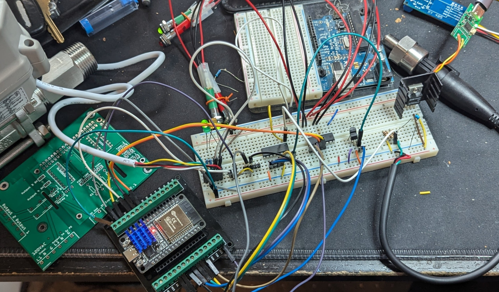
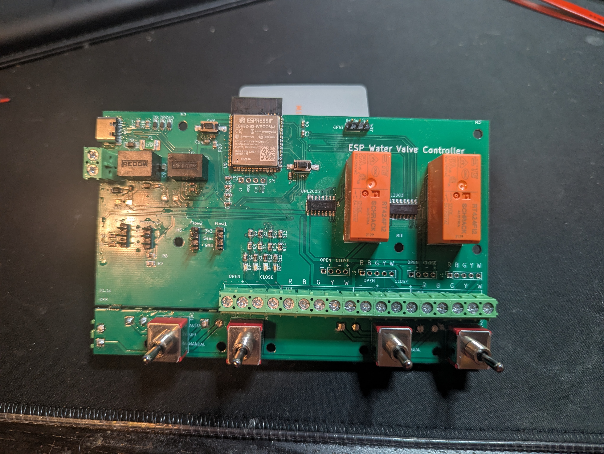
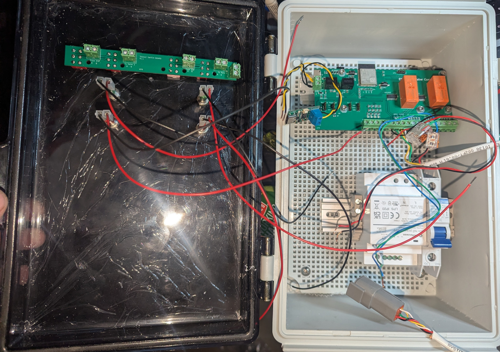
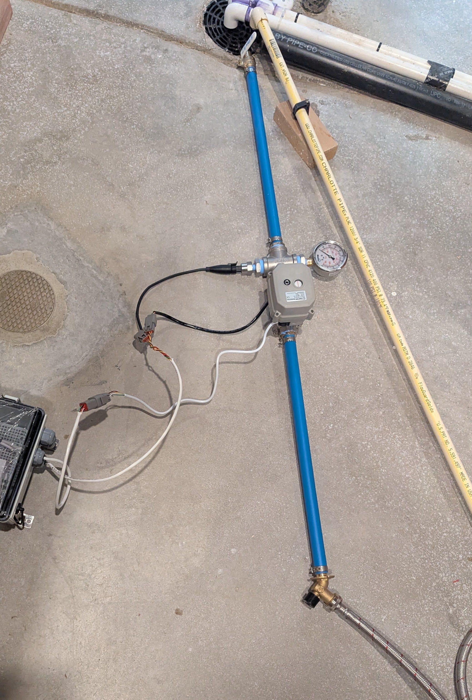
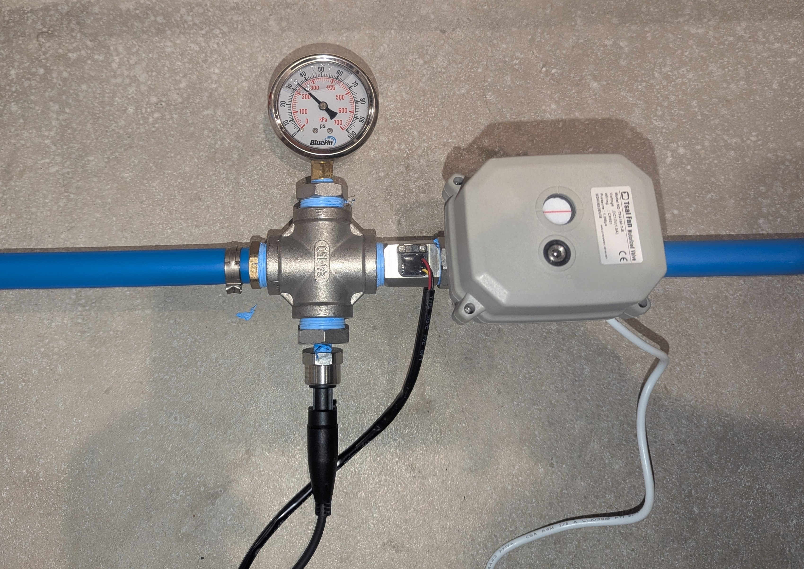
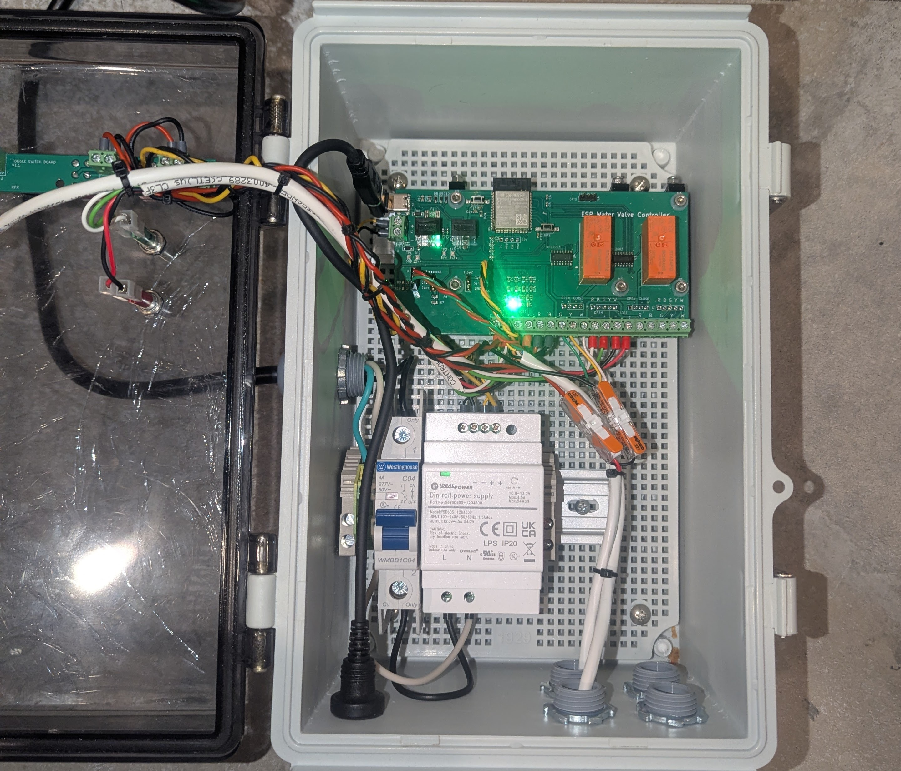
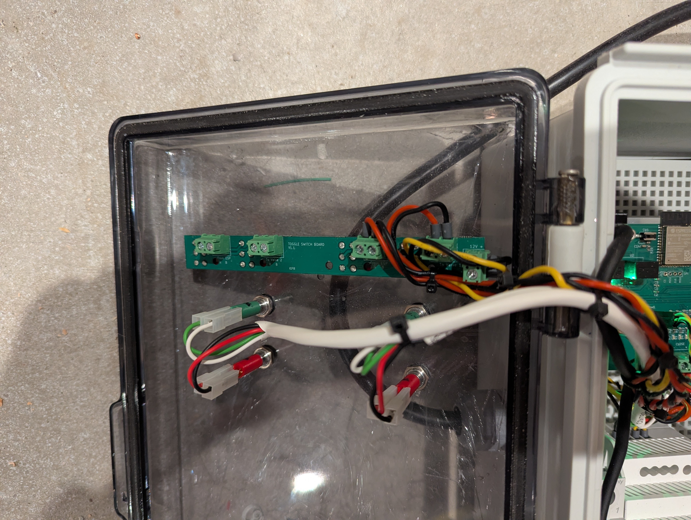
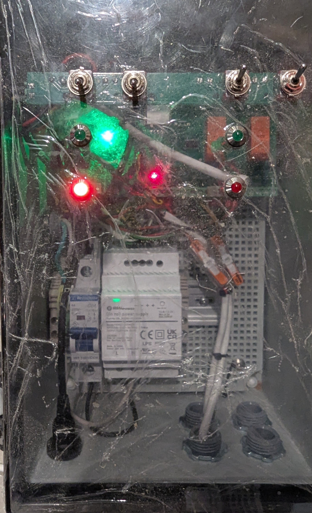

# Hardware Documentation

This folder documents the ESP32 Water Valve Controller hardware build.

Use the board labels from the PCB and KiCad files throughout the hardware docs:

- Valve 1
- Valve 2

Software may allow custom names later, but the hardware build guide uses the physical board labels.

## Main documents

- `bom.md` - simplified builder-facing BOM
- `pinouts.md` - board connector pinouts
- `breakaway-front-panel-controls.md` - optional manual/auto front-panel control board
- `bring-up-checklist.md` - first power-up and test checklist

## Hardware Build Guide

This is a high-level build guide for the ESP32 Water Valve Controller hardware.

### Build order

1. Inspect the bare PCB.
2. Assemble the PCB.
3. Inspect solder joints and orientation-sensitive parts.
4. Separate the breakaway front-panel control section if it will be used.
5. Mount the main PCB in the enclosure.
6. Mount the breakaway control section and panel LEDs on the enclosure front panel.
7. Wire the 12 V DIN rail power supply and DIN terminal blocks.
8. Wire Valve 1 and Valve 2.
9. Wire the flow and pressure sensors.
10. Power up without plumbing pressure and run the bring-up checklist.
11. Test valve open/close behavior.
12. Test sensor readings.
13. Perform plumbing tests and calibration.

## Build photos

These photos document the prototype, assembly, enclosure wiring, plumbing test, pressure calibration, front panel, and breakaway switch wiring.

### Photo index

| Photo | Description |
| --- | --- |
| [Early prototyping](images/early-prototyping.jpg) | Early hardware prototyping before the final enclosure layout. |
| [Soldering complete](images/soldering-complete.jpg) | Assembled PCB after soldering. |
| [First enclosure wiring and testing](images/first-enclosure-wiring-and-testing.jpg) | Initial wiring inside the enclosure during testing. |
| [First plumbing test](images/first-plumbing-test-hose-floor-drain.jpg) | Initial plumbing test using a hose and floor drain. |
| [Pressure sensor calibration](images/pressure-sensor-calibration-analog-gauge.jpg) | Pressure sensor calibration using an analog pressure gauge. |
| [Inside of enclosure](images/inside-enclosure.jpg) | Internal enclosure layout with mounted electronics and wiring. |
| [Breakaway switch board wiring](images/breakaway-switch-board-bypass-wiring-enclosure-door.jpg) | Breakaway switch/control board bypass wiring mounted on the enclosure door. |
| [Outside of enclosure with LEDs](images/outside-enclosure-leds-wip.jpg) | Front of the enclosure showing panel LEDs. Work in progress; final labels still needed. |

### Gallery

#### Early prototyping

Early hardware prototyping before the final enclosure layout.

#### Soldering complete

Assembled PCB after soldering.

#### First enclosure wiring and testing

Initial wiring inside the enclosure during testing.

#### First plumbing test

Initial plumbing test using a hose and floor drain.
#### Pressure sensor calibration

Pressure sensor calibration using an analog pressure gauge.

#### Inside of enclosure

Internal enclosure layout with mounted electronics and wiring.

#### Breakaway switch board wiring

Breakaway switch/control board bypass wiring mounted on the enclosure door.

#### Outside of enclosure with LEDs

Front of the enclosure showing panel LEDs. Work in progress; final labels still needed.

